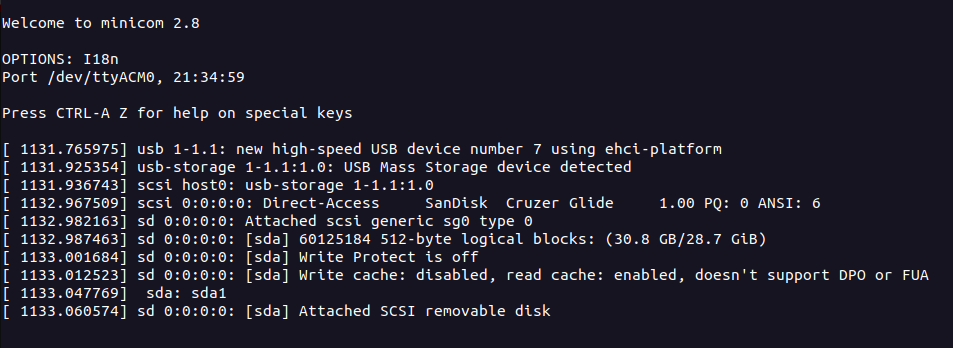
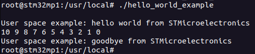

# Developer Package

This enables:

- Cross compilation
- Using the required version of the C compiler (GCC)
- etc.

To follow along the [official tutorial](https://wiki.st.com/stm32mpu/wiki/STM32MP1_Developer_Package#Installing_the_Starter_Package), go to  *Section 5: Installing the components to develop software running on Arm Cortex-A (OpenSTLinux distribution)*.

!!! warning

    Before proceeding, install OpenSTLinux by using the [Starter Package](./starter-package.md).

## Software Development Kit (SDK)

### Installing the SDK

Create and move to your working directory:
```
mkdir developer-package
cd developer-package
```

Create and move to a sub-folder to keep your SDK **installer**:
```
mkdir sdk-installation
cd sdk-installation
```

- Download the SDK from the [OpenSTLinux Developer Package](https://www.st.com/en/embedded-software/stm32mp1dev.html#overview) page.
  - Run the `uname -m` command and take note of your host architecture.
  - Download the package labeled `Yocto_SDK[your_host_architecture]`.
  - Move this package to `developer-package/sdk-installation`


!!! note

    This example follows a host architecture of `x86_64`, so keep in mind that file/folder names may be slightly different.

Extract the compressed files:

```
tar xvf en.SDK-x86_64-stm32mp1-openstlinux-6.1-yocto-mickledore-mp1-v23.06.21.tar.gz
```

Make a new folder from your working directory to keep your installer. For the sake of this example, here is my working directory so far:

```
developer-package/
|-- sdk-installation/
    |-- en.SDK-x86_64-stm32mp1-openstlinux-6.1-yocto-mickledore-mp1-v23.06.21.tar.gz
    |-- en.SDK-x86_64-stm32mp1-openstlinux-6.1-yocto-mickledore-mp1-v23.06.21/
        |-- yocto manifest files
        |-- installation shell script (ends with .sh)
|-- SDK
    |-- We will install the SDK here
```

From the `sdk-installation/` folder, mark the installation script as an executable:

```
chmod +x stm32mp1-openstlinux-___-v23.06.21/sdk/st-image-weston-___-v23.06.21.sh
```

!!! warning

    I am intentionally shortening the names with `___`. Remember, tab completion is your friend! You do not have to manually type this.

Run the installation script, and store it in `developer-package/SDK/`:

- The `-d` flag allows you to specify the target directory to keep the SDK.

```
./stm32mp1-openstlinux-___-v23.06.21/sdk/st-image-weston-___-v23.06.21.sh -d ./../SDK/
```


### Source/Activate the SDK

From the `developer-package/` directory, source the SDK:

- Alternatively, you can use `.` instead of `source`.

```
source SDK/environment-setup-cortexa7t2hf-neon-vfpv4-ostl-linux-gnueabi

```

This must be done for every new terminal instance that is going to cross-compile.


### Verifying the SDK

Call the following environment variables. If successful, the terminal will respond with feedback. Otherwise, the terminal will respond with an empty line.

Check the target architecture:

```
echo $ARCH
```

Check the toolchain prefix:

```
echo $CROSS_COMPILE
```

Check the C compiler version:

```
$CC --version
```

Check the SDK version:

```
echo $OECORE_SDK_VERSION
```


## Running a User-space Application

Suppose that we have a program that we want to run on the stm32mp1 device. We will need to leverage the SDK to cross-compile the application to be able to run on the target device's computer architecture and hardware.

### Cross-compiling

First, [source the SDK](#sourceactivate-the-sdk). Make sure to re-do this step if you create a new terminal instance.

Create the application directory:

```
mkdir hello_world_example
cd hello_world_example
```

Add the following `hello_world_example.c` source code and Makefile:

```C
// SPDX-identifier: GPL-2.0
/*
 * Copyright (C) STMicroelectronics SA 2018
 *
 * Authors: Jean-Christophe Trotin <jean-christophe.trotin@st.com>
 *
 */

#include <stdio.h>
#include <unistd.h>

int main(int argc, char **argv)
{
	int i =11;

	printf("\nUser space example: hello world from STMicroelectronics\n");
	setbuf(stdout,NULL);
	while (i--) {
		printf("%i ", i);
		sleep(1);
	}
	printf("\nUser space example: goodbye from STMicroelectronics\n");

	return(0);
}
```

```Makefile
PROG = hello_world_example
SRCS = hello_world_example.c
OBJS = $(SRCS:.c=.o)

CLEANFILES = $(PROG)
INSTALL_DIR = ./install_artifact/usr/local/bin

# Add / change option in CFLAGS if needed
# CFLAGS += <new option>

$(PROG):  $(OBJS)
	$(CC) $(CFLAGS) -o $(PROG) $(OBJS)

.c.o:
	$(CC) $(CFLAGS) -c $< -o $@

all: $(PROG)
 
 
clean:
	rm -f $(CLEANFILES) $(patsubst %.c,%.o, $(SRCS)) *~

install: $(PROG)
	mkdir -p $(INSTALL_DIR)
	install $(PROG) $(INSTALL_DIR)
```

You should have the following:

```
developer-package/
|-- sdk-installation/
|-- SDK/
|-- hello_world_example/
    |-- hello_world_example.c
    |-- Makefile
```

Note that the Makefile is using flags belonging to the SDK. This allows us to cross-compile the code to run on the board:

```
make
make install
```

Due to the `install` option defined in the Makefile, the resulting binary is stored in `./install_artifact/usr/local/bin`. Copy this binary file to a USB flash drive.

### Transferring

!!! tip

    This example transfers files using a simple USB flash drive. If the device is connected to a network, Linux commands such as `scp` may also work. 

Connect the USB flash drive into the stm32MP1. If your host device is connected to the device's ST-Link through a Minicom session, you will see the USB flash drive detected.



!!! warning

    Errors were experienced when using a USB flash drive formatted to use an Ex-FAT file system. However, FAT32 seemed to work just fine.

!!! success

    Notice that the following steps have a terminal prompt of `root@stm32mp1:~#`. This is to indicate that the command is intended to be entered on the target device's terminal.

Mount the contents of the USB flash drive to a mounting point:

- In the above screenshot of the output, you see that `sda1` is assigned to `sda`. This is subject to change. You may see `sda2` or even `sba1`.

```
root@stm32mp1:~# mount /dev/sda1 /mnt
```

Copy the binary file from the USB flash drive to local storage:

```
root@stm32mp1:~# cp /mnt/temp/hello_world_example /usr/local
```

Refresh:

```
root@stm32mp1:~# sync
```

### Run

Mark the binary file as an executable and run.

```
root@stm32mp1:~# cd /usr/local
root@stm32mp1:~# chmod +x hello_world_example
root@stm32mp1:~# ./hello_world_example
```

If successful, you will see the following output from the application:




