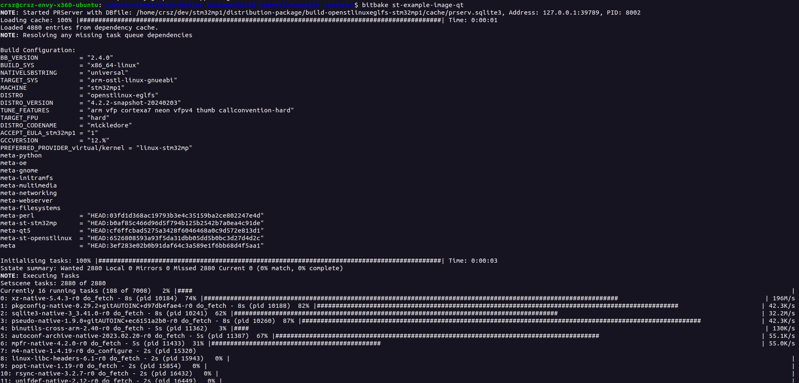

# Running Qt5 Apps

Previously, the [Starter Package](./starter-package.md) installed OpenSTLinux and prepared the SD card. Then, the [Developer Package](./developer-package.md) taught us how to cross-compile a program to run it on the target device. This was done by using a pre-built SDK made by ST. They had built that SDK using Yocto and it is intended for OpenSTLinux, which is also built using Yocto.

Here, we are going to leverage ST's Distribution Package. We are essentially using Yocto and OpenEmbedded along with ST's meta-layer to build a custom Linux distro. This will allow us to pre-package the Qt5 framework into the custom Linux image. That is, the stm32mp1 device should already have Qt5 installed to run GUI apps after flashing the SD card.

- [Reference](https://wiki.st.com/stm32mpu/wiki/How_to_build_and_use_an_SDK_for_QT).
- [Example Article](https://barenakedembedded.com/how-to-set-up-stm32mp1-with-qt/).

!!! info

    Be aware of [Yocto's Official Documentation](https://docs.yoctoproject.org/), and be mindful of the version being covered on its pages.

!!! warning

    Up to this point, it is highly recommended to develop on a **native** Linux machine. Build times will be incredibly long and demand a lot of storage/memory.

## Installing Yocto and Dependencies

### Install Repo

```
  sudo apt-get update
  sudo apt-get install repo
```

Verify:

```
repo version
```

### Packages Required by OpenEmbedded/Yocto

```
sudo apt-get install gawk wget git diffstat unzip texinfo gcc-multilib  chrpath socat cpio python3 python3-pip python3-pexpect 
```

```
sudo apt-get install xz-utils debianutils iputils-ping python3-git python3-jinja2 libegl1-mesa libsdl1.2-dev pylint xterm bsdmainutils
```

```
sudo apt-get install libssl-dev libgmp-dev libmpc-dev lz4 zstd
```

### Useful Packages and Tools

```
sudo apt-get install build-essential libncurses-dev libyaml-dev libssl-dev 
```

```
sudo apt-get install coreutils bsdmainutils sed curl bc lrzsz corkscrew cvs subversion mercurial nfs-common nfs-kernel-server libarchive-zip-perl dos2unix texi2html libxml2-utils
```

### Yocto-Required Packages for the Buildhost

The following are required according to the [System Requirements section 1.4](https://docs.yoctoproject.org/4.2.4/ref-manual/system-requirements.html#required-packages-for-the-build-host):

```
sudo apt install gawk wget git diffstat unzip texinfo gcc build-essential chrpath socat cpio python3 python3-pip python3-pexpect xz-utils debianutils iputils-ping python3-git python3-jinja2 libegl1-mesa libsdl1.2-dev python3-subunit mesa-common-dev zstd liblz4-tool file locales
sudo locale-gen en_US.UTF-8
```


## Setting Up the Custom Linux Image

Create your working directory:

```
mkdir distribution-package
cd distribution-package
```

### Download and Initialize the Repo Manifest

It is common practice for vendors to have a repository referred to as the *Repo Manifest*. This sets up the Yocto build system for supported products

Note that the `repo init` command is pointing to [tags from ST's manifest repository](https://github.com/STMicroelectronics/oe-manifest). Also note that this repository's `default.xml` file is listing other layers to download.

```
repo init -u https://github.com/STMicroelectronics/oe-manifest.git -b refs/tags/[latest tag]
```

```
repo init -u https://github.com/STMicroelectronics/oe-manifest.git -b refs/tags/openstlinux-6.1-yocto-mickledore-mp1-v23.11.15
repo sync
```


!!! info

    For information about the resulting `distribution-package/` directory, see [Installing the OpenSTLinux Distribution](https://wiki.st.com/stm32mpu/wiki/STM32MP1_Distribution_Package#Installing_the_OpenSTLinux_distribution).


### Initializing the OpenEmbedded (OE) Build Environment

Accept terms and agreeements.

Available `DISTRO` and `MACHINE` variables are shown in the [OpenSTLinux distribution](https://wiki.st.com/stm32mpu/wiki/OpenSTLinux_distribution) page.

This command enables the build environment, and creates the `build.../` folder.


```
DISTRO=openstlinux-eglfs MACHINE=stm32mp1 source layers/meta-st/scripts/envsetup.sh
```


!!! tip

    If the build process in the [Build the Image](#build-the-image) or [Building the SDK](#using-the-image-to-build-an-sdk) sections suddenly shut the terminal mid-process without any indication, your host machine's resources may be overloaded. To get your host machine to successfully finish the build, you may want to limit the amount of threads and the amount of threads performing the `do_compile` task of each recipe in each layer.

    Inside the `build.../` folder, there is a `conf/local.conf` file. Open the file and write the following at the bottom:

    ```
    PARALLEL_MAKE = "-j 10"
    BB_NUMBER_THREADS = "10"
    ```


### Build the Image

!!! warning

    Be sure to set aside plenty of time for `bitbake` commands. On my personal host machine, a successful session of this section took about 5 hours to complete.

```
bitbake [image]
```

```
bitbake st-example-image-qt
```



!!! failure

    Some packages may fail to build. So, use `bitbake --continue st-example-image-qt` to keep building despite an error with a package. All of the failed packages will be listed in the output when the command finally finishes. Then, do the following for each failed package:

    ```
    bitbake -c cleanall [failed_package]
    bitbake [failed_package]
    ```

    Do this manually for all the failed packages, and then re-run `bitbake --continue st-example-image-qt`.

!!! tip

    For more flags to the `bitbake` command, see [bitbake tasks](https://wiki.rdkcentral.com/display/RDK/Yocto+Developer+Guide) that work with the `bitbake -c [task]` command.

### Flashing the Board with the New Linux Image

Follow the same process as described in the [Starter Package](./starter-package.md) for flashing the board with STM32CubeProgrammer.

The `.tsv` file is located in the following directory:
 
`distribution-package/build-openstlinuxeglfs-stm32mp1/tmp-glibc/deploy/images/stm32mp1/flashlayout_st-example-image-qt/extensible`

Notice that the subfolder is named `/build-[image]-[machine]/` based on our `IMAGE` and `MACHINE` variables when setting the build environment.

Using the `ll` command here will yield the following contents:


Select the `.tsv` that is appropriate for your board.

As for selecting the *Binaries path* on STM32CubeProgrammer, select the following directory: `distribution-package/build-openstlinuxeglfs-stm32mp1/tmp-glibc/deploy/images/stm32mp1`

Using `ll` yields the following contents. Note that there is so many files, that the screenshot below does not show everything.


### Running Pre-Packaged Example Apps

These applications are already cross-compiled to run on our particular embedded device. They were included in the custom Linux image.

- Set both BOOT switches to `1`
- Insert the flashed Micro-SD card
- Connect to the display
- Connect to the internet via Ethernet cable
- Power on

You will see a still "OpenSTLinux" splash screen that does not do anything other than display the image.

On the PC, login to the device terminal. To do so, see the [Terminal and Serial](./terminal-and-serial.md) page.

Now, remove the splash screen:

```
psplash-drm-quit
```

The screen should be blank now, with nothing to display.

```
cd /usr/share/examples/
```

Here, there are plenty of examples in folders/sub-folders with their respective executable. For instance,

```
cd opengl/hellowindow
./hellowindow
```

The screen should now display a 3D "Qt" object rotating.

## Setting up the Custom SDK

We have a custom Linux distro successfully running on the target device. Now, suppose that we want to run our own application on this custom distro. We must first build our own SDK based on the custom image to cross-compile the application.

### Build the SDK

!!! warning

    Be sure to set aside plenty of time for bitbake commands. On my personal host machine, a successful session of this section took about 5 hours to complete after reducing the amount of threads and tasks that are allowed to run.

[Source your environment](#initializing-the-openembedded-oe-build-environment) again and return to your `build/...` folder. Run the following command:

```
bitbake --continue st-example-image-qt -c populate_sdk
```

!!! failure

    Note that this command brought issues unless it ran completely without interruption. If an error occurs (such as the terminal crashing due to lack of memory, or the `gcc-crosssdk` recipe not being found as shown below), manually delete the `build/...` folder and repeat the process.

    


Due to the `--continue` flag, the final output will include a list of packages/recipes that failed to compile -- if any, at all. To fix this, clean and build each package manually before re-runnig `populate_sdk`.

```
bitbake -c cleansstate [recipe]
bitbake [recipe]
```

The newly generated SDK can be found in the following directory: `tmp-glibc/deploy/sdk`.

### Installing Qt5

First, install the Qt Creator IDE by visiting the [Qt for Open Source Development](https://www.qt.io/download-open-source). Scroll down and select the Qt Online Installer. This will include the most up-to-date version of Qt. At the time of this writing, that would be version 6. However, the Repo Manifest used here refers to the `meta-qt5` layer, not Qt6. 

Install Qt5:

```
sudo apt install -y qtcreator qtbase5-dev qt5-qmake cmake
```

Install examples and the necessary packages to make them viewable on Qt Creator:

```
sudo apt-get install qtbase5-examples qtbase5-doc-html
sudo apt install -y qtquickcontrols2-5-examples qt5-doc qt5-doc-html qml-module-qtquick-controls2
```

Install Qt Creator's preferred compiler:

```
sudo apt install clang
```

Next, we must configure Qt Creator to find the directory path to your Qt5 installation. Specifically, we need Qt's flavor of CMake, `qmake`. You may be able to find it in `/lib/qt5/bin/qmake`.

!!! warning

    As of Qt6 and going forward, CMake will be officially preferred over QMake.

Go to **Preferences** > **Kits** > **Qt Versions** tab > **Add** the path.


Next, we want to add a *Kit*. This is similar to having different build-profiles.

Go to **Preferences** > **Kits** > **Kits** tab > **Add** to create a kit. Be sure to specify the Qt version.


When you open Qt Creator, you should be able to see examples for Qt 5 after you toggle the version within the drop-down selector in the top-left corner.


You are welcome to select any of these example projects to display on the board. For instance, the *Chart Example* worked sucessfully. Just be sure that you can compile and run the GUI application on your host machine.

### Displaying a Qt5 Application

Finally, we are going to leverage our custom SDK to cross-compile our GUI app. This will be following steps similar to that of the [Developer Package: Installing the SDK](./developer-package.md#installing-the-sdk) section.

At the root location of the `distribution-package/` folder, create an `SDK/` folder.

Recall that you can find the installation script for the custom SDK in the following path:

```
cd build-openstlinuxeglfs-stm32mp1/tmp-glibc/deploy/sdk/
```


Run the installer and store the SDK in `SDK/`:

```
./st-example-image-qt-openstlinux-___-snapshot.sh -d ./../../../../SDK/
```

Source the installer:

```
source SDK/environment-setup-cortexa7t2hf-neon-vfpv4-ostl-linux-gnueabi
```

Now, move to the project directory of the Qt project you intend to run. Compile:

```
qmake && make
```

You will find a newly created executable in the same directory. This is what you need to transfer and run on target device. From here, you can follow the same steps for [transferring and running a user-space application](./developer-package.md#transferring).

Remember to kill the OpenSTLinux splashscreen to see your app displayed on the screen:
```
psplash-drm-quit
```
