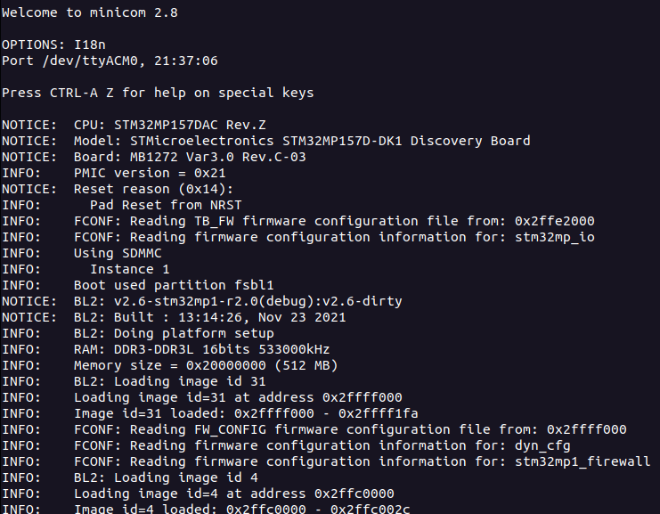
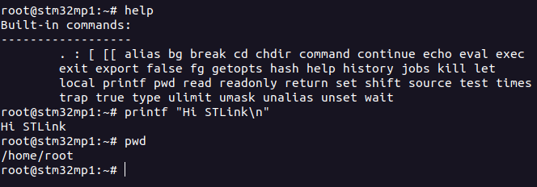

# Terminal and Serial Output

## Accessing the Terminal

### Connecting via TTY

Connect your host PC to the board's micro-USB port. This is a virtual port serving as a terminal. The board does this by connecting to a TTY.

!!! info

    You can find more background info on TTYs and Linux here:

    - [What is TTY in Linux?](https://itsfoss.com/what-is-tty-in-linux/)
    - [PTY vs TTY](https://www.baeldung.com/linux/pty-vs-tty)


Install `minicom`:

```
sudo apt-get install minicom
```

- The board has two TTY sessions.
  - `ttyS0` corresponds to standard UART.
  - `ttyACM0` corresponds to the STLink interface.

Connect to the STLink interface through the board's TTY file:

```
sudo minicom -D /dev/ttyACM0
```

!!! tip

    If `ttyACM0` is not the correct file, check the files in the `/dev/` directory before and after the board's micro-USB is plugged in to detect the correct file.

By default, STLink is running with a baud rate of 115200. `minicom` also has this baud rate by default. But, if configuring the settings is ever necessary, do so using the `sudo minicom -s` command.

Press the RESET button, and you will see serial output containing bootup information.



Press Enter and you will be given a terminal prompt looking something like `root@stm32mp1:~#` where you can run some commands.



For more information on the board's TTY, check ST's [How to Use TTY with User Terminal](https://wiki.st.com/stm32mpu/wiki/How_to_use_TTY_with_User_Terminal) page.

### Connecting via SSH

- Ensure the device is connected to a network through Ethernet or a wireless receiver.
- Determine the device's assigned IP address.

Remotely access the device:
```
ssh root@[ip address]
```

Here, `root` is used as there are no default user accounts on the custom Linux image.


## Reading Serial Output

Follow a process similar to the one described in [Connecting via TTY](#connecting-via-tty). This time, connect to `ttyS0`.


