# Fat FS

This page was last updated: *{{ git_revision_date_localized }}*

## Details

- A wrapper class based on [ChaN's FatFS module](http://elm-chan.org/fsw/ff/).
- Compatible with USB OTG (On the Go) and SDIO communication protocols.
- Additional information can be found in ST's USB Host Library User Manual[^1].

<figure markdown>
  
  <figcaption>Fat FS API interactions.</figcaption>
</figure>

<figure markdown>
  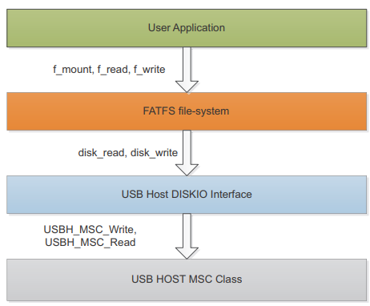
  <figcaption>USB Host library interactions.</figcaption>
</figure>

[^1]: ST's [USB Host Library](https://www.st.com/resource/en/user_manual/um1720-stm32cube-usb-host-library-stmicroelectronics.pdf) user manual.

## CubeMX Platform Integrations

Integrating the library with the CubeMX settings is discussed first as this impacts how the device connecting/ejecting is to be synchronized with the library's usage.

### USB in a Baremetal Environment

ControllersTech's [STM32 USB Host MSC](https://controllerstech.com/stm32-usb-host-msc/) article and video are great references for enabling logging to a USB flash drive.

The following peripherals and libraries need to be made on CubeMX:

- USB OTG FS (Full Speed)
- Enable USB HOST
- FatFS Library

USB OTG FS communicates at 12 Mbps. Set its *Mode* to operate in `Host_Only`, and activate the 5 Volt `VBus` line to power the USB flash drive. Leave the **Parameter Settings**, **User Constants**, **NVIC Settings**, and **GPIO Settings** to their default values.

<figure markdown>
  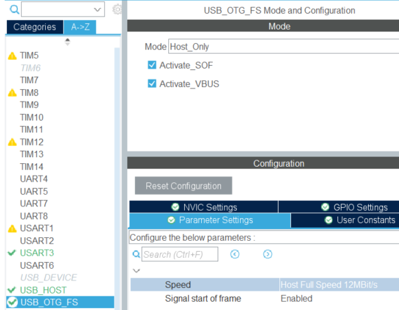
  <figcaption>USB OTF Full Speed configurations.</figcaption>
</figure>

USB HOST's *Class for FS IP* should be set to `Mass Storage Host Class`. Go to the **Platfom Settings** tab and verify that *Drive_VBUS_FS* is configured to with `GPIO:Output` set to the pin responsible for providing the VBus line. This varies per microcontroller and can be verified by observing the board's schematics. For instance, on the Nucleo F429ZI development board, pin `PG6` is responsible for powering the USB (that is, VBUS).

<figure markdown>
  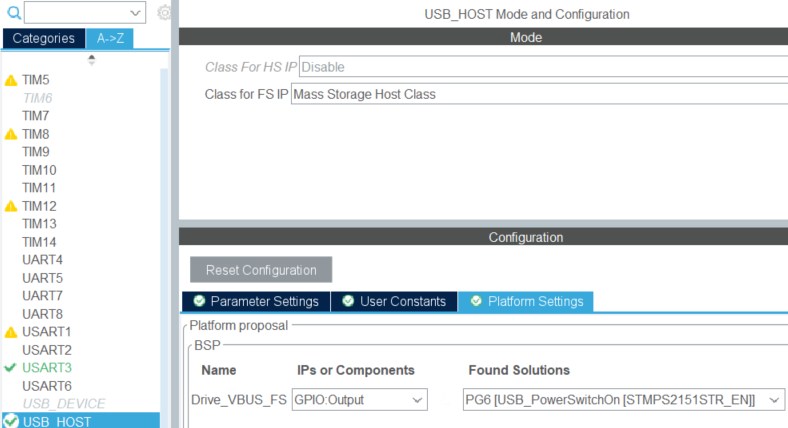
  <figcaption>USB Host configurations.</figcaption>
</figure>

<figure markdown>
  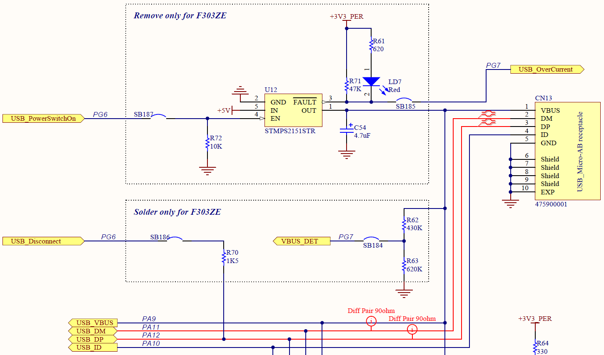
  <figcaption>USB Port and VBus schematic for Nucleo F429ZI.</figcaption>
</figure>

If done correctly, the `LD7` LED light on the Nucleo F429ZI should be lit when running the program. This confirms that the board is providing power to the USB flash drive. [^2]

[^2]: ST's [Nucleo-144 Boards](https://www.st.com/resource/en/user_manual/um1974-stm32-nucleo144-boards-mb1137-stmicroelectronics.pdf) user manual.

<figure markdown>
  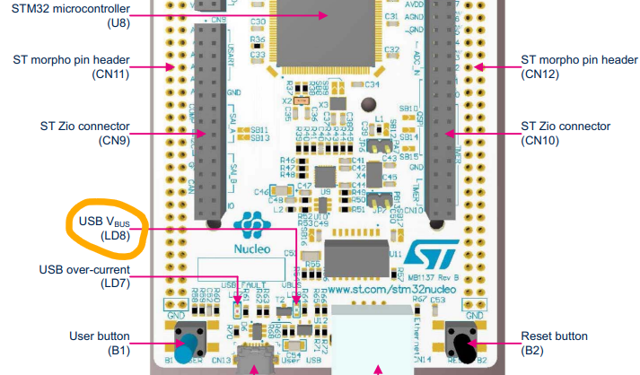
  <figcaption>Nucleo F429ZI's VBus LED light.</figcaption>
</figure>

!!! success
    For reference, the schematics can be downloaded from the dev board's [Product Page](https://www.st.com/en/evaluation-tools/nucleo-f429zi.html#cad-resources) under `CAD Resources > Schematic Pack > Schematics`. After extracting the folder, a PDF of the schematics is contained inside the folder.

Lastly, enable FATFS to operate in the `USB Disk` mode, enable Long File Naming (*USE_LFN*), set Maximum Sector Size (*MAX_SS*) to `4096`, and enable the exFAT file system (*FS_EXFAT*) for portability across user devices.

<figure markdown>
  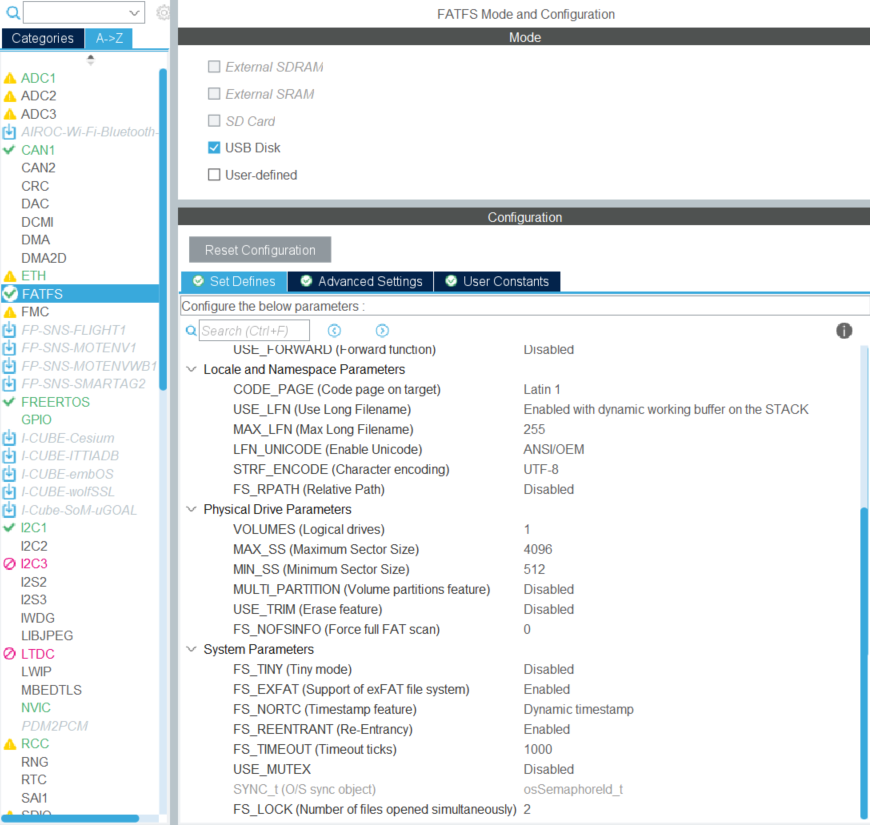
  <figcaption>FATFS configurations.</figcaption>
</figure>

Saving your CubeMX `.ioc` configurations for auto-generating the code will add the `FATFS/` and `USB_HOST/` folder — resulting in the following project structure:

```
CubeIDE Project/
|-- Core/
|-- Drivers/
|-- FATFS/
|-- Middlewares/
|-- USB_HOST/
```

Following ControllersTech's [STM32 USB Host MSC](https://controllerstech.com/stm32-usb-host-msc/) demonstration, there are pieces of code to be aware of. First, the USB Host is updated periodically, in `main.c`:

```C
int main(void) {
    HAL_Init();
    SystemClock_Config();

    MX_FATFS_Init();
    MX_USB_HOST_Init();

    while (1) {
        MX_USB_HOST_Process();
    }
}
```

`MX_USB_HOST_Process()` is a helper function for calling `USBH_Process()`, in `USB_HOST/App/usb_host.c`. The application code can be placed in this file instead of in the main function, and defines a switch statement that behaves like a state machine with interrupts handled by the USB Host library:

```C
static void USBH_UserProcess  (USBH_HandleTypeDef *phost, uint8_t id)
{
  /* USER CODE BEGIN CALL_BACK_1 */
  switch(id)
  {
  case HOST_USER_SELECT_CONFIGURATION:
  break;

  case HOST_USER_DISCONNECTION:
  Appli_state = APPLICATION_DISCONNECT;
  // Unmount the USB device for ejection here.
  break;

  case HOST_USER_CLASS_ACTIVE:
  Appli_state = APPLICATION_READY;
  // Mount the USB device and perform operations here.
  break;

  case HOST_USER_CONNECTION:
  Appli_state = APPLICATION_START;
  break;

  default:
  break;
  }
  /* USER CODE END CALL_BACK_1 */
}
```

The `HOST_USER_DISCONNECTION` case is executed when the USB is physically disconnected and the `HOST_USER_CLASS_ACTIVE` case is executed when the USB is physically connected.

This solution works for a brute-forced solution in a C environment, but how can we leverage our C++ library with this? Adding C++ code such as namespaces or classes to `usb_host.c` will not work because this is automatically configured by CubeIDE to be compiled with the C compiler. This obsticle applies to the other auto-generated files and folders. This has driven us to add `Program/` folder to the CubeIDE project and enabled the C++ compiler to point to it. With C (USB state machine) and C++ (our custom libraries) in separate directories, they need a solution for synchronization. For a proof of concept, boolean variables are sufficient.

In `USB_HOST/App/usb_host.c`:

```C
/* USER CODE BEGIN Includes */
uint8_t to_log = 0;
uint8_t to_unmount = 0;

static void USBH_UserProcess  (USBH_HandleTypeDef *phost, uint8_t id)
{
  /* USER CODE BEGIN CALL_BACK_1 */
  switch(id)
  {
  case HOST_USER_SELECT_CONFIGURATION:
  break;

  case HOST_USER_DISCONNECTION:
  Appli_state = APPLICATION_DISCONNECT;
  to_unmount = 1; // Set the unmounting flag
  break;

  case HOST_USER_CLASS_ACTIVE:
  Appli_state = APPLICATION_READY;
  to_log = 1; // Set the logging flag
  break;

  case HOST_USER_CONNECTION:
  Appli_state = APPLICATION_START;
  break;

  default:
  break;
  }
  /* USER CODE END CALL_BACK_1 */
}
```

In `Program/Src/app.cpp`:

```C++
// 3rd Party Libraryes and Frameworks
#include "fatfs.h"
extern char USBHPath[4];   // USBH logical drive path
extern FATFS USBHFatFS;    // File system object for USBH logical drive
extern FIL USBHFile;       // File object for USBH
#include "usb_host.h"

int cppMain() {
    MX_USB_HOST_Init();

    // Initialize our FatFs wrapper class
    application::FatFs file_system(USBHPath, USBHFatFS, USBHFile);

    for (;;) {
        if(to_log == 1) {
            printf("Logging to USB\n");
            file_system.Mount();

            // Perform operations
            
            to_log = 0;

        } else if (to_unmount == 1) {
            file_system.Unmount();
            to_unmount = 0;
            printf("USB ejected\n");
        }
    }

    return 0;
}
```

### USB in an RTOS Environment

Enabling FreeRTOS on CubeMX will cause some of the USB peripheral code to be generated slightly differently. If you check the USB Host's **Parameter Settings**, an additional *CMSIS_RTOS* category of configurable fields have appeared at the bottom.

<figure markdown>
  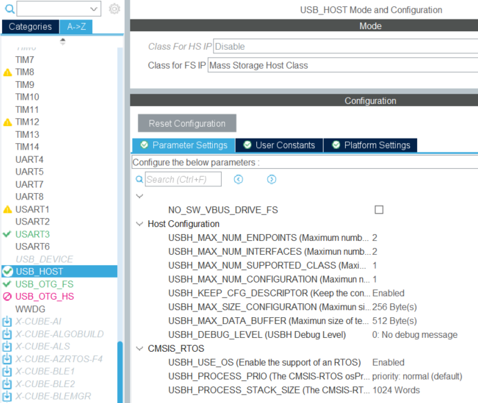
  <figcaption>USB Host configurations with FreeRTOS.</figcaption>
</figure>

These settings reveal that CubeMX is generating code for initializing another thread behind the scenes. Examining the generated firmware closely has led to the `Middlewares/ST/STM32_USB_Host_library/Core/Src/usbh_core.c` file. This defines a function `USBH_Process_OS()` that calls `USBH_Process()` in a `USBH_Thread` thread — provided that the *USBH_USE_OS* field of the USB Host's **Parameter Settings** is enabled.

In `Middlewares/ST/STM32_USB_Host_library/Core/Src/usbh_core.c`:

```C
#if (USBH_USE_OS == 1U)
#if (osCMSIS < 0x20000U)

  /* Create USB Host Queue */
  osMessageQDef(USBH_Queue, MSGQUEUE_OBJECTS, uint16_t);
  phost->os_event = osMessageCreate(osMessageQ(USBH_Queue), NULL);

  /* Create USB Host Task */
#if defined (USBH_PROCESS_STACK_SIZE)
  osThreadDef(USBH_Thread, USBH_Process_OS, USBH_PROCESS_PRIO, 0U, USBH_PROCESS_STACK_SIZE);
#else
  osThreadDef(USBH_Thread, USBH_Process_OS, USBH_PROCESS_PRIO, 0U, 8U * configMINIMAL_STACK_SIZE);
#endif /* defined (USBH_PROCESS_STACK_SIZE) */

  phost->thread = osThreadCreate(osThread(USBH_Thread), phost);

// ...

#if (osCMSIS < 0x20000U)
static void USBH_Process_OS(void const *argument)
{
  osEvent event;

  for (;;)
  {
    event = osMessageGet(((USBH_HandleTypeDef *)argument)->os_event, osWaitForever);
    if (event.status == osEventMessage)
    {
      USBH_Process((USBH_HandleTypeDef *)argument);
    }
  }
}
#endif
```

Recall that  `USBH_Process()` was called through the `MX_USB_HOST_Process()` helper function in the [USB in a Baremetal Environment](#usb-in-a-baremetal-environment) section. The helper function was manually called in the superloop. Now, with FreeRTOS enabled, this is instead handled by the `USBH_Thread` thread and is not exposed to us.

However, to make this thread functional, **it is vitally important to increase the stack size to 1024**. This can be done by setting the *USBH_PROCESS_STACK_SIZE* to `1024 Words`, as shown in the configuration image above. By default, this is set to only 128.

Moving on, since the USB Host leverages interrupts to update its state machine, additional configurations are required to make it functional with FreeRTOS. In the NVIC settings, the *Preemption Priority* column of the *USB On The Go FS global interrupt* field is set to `15`. This lowers the priority of the USB's interrupt so that it does not conflict with other pre-existing system interrupts.

!!! tip
    A lower preemption priority corresponds to a logically higher numerical value. The higher the value, the lower the priority. Thus, the USB's interrupt was changed from a default value of 5 to the lowest support value of 15.

<figure markdown>
  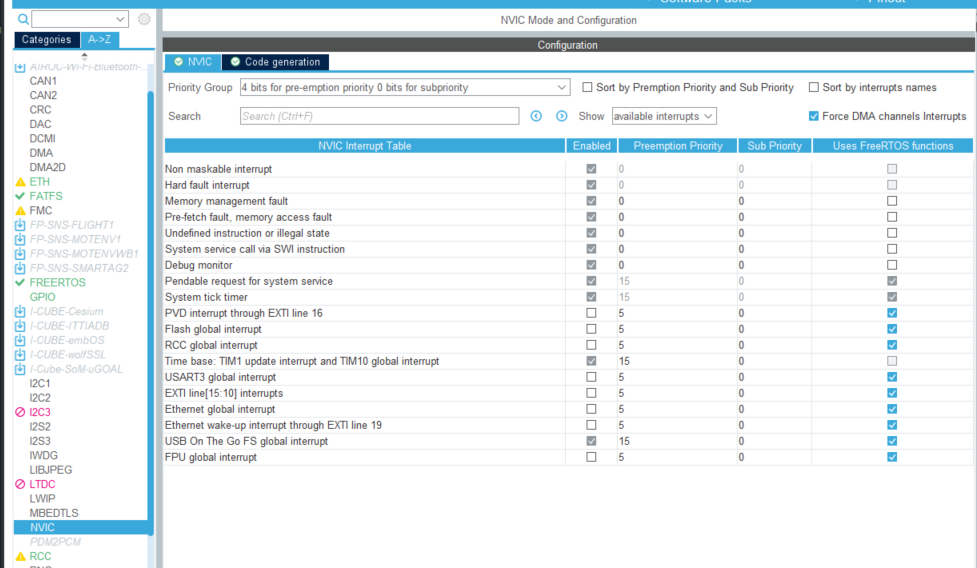
  <figcaption>Configuring USB's global interrupt on the NVIC settings.</figcaption>
</figure>

!!! warning
    Allowing CubeMX to generate code with these new configurations yields the following warning:

    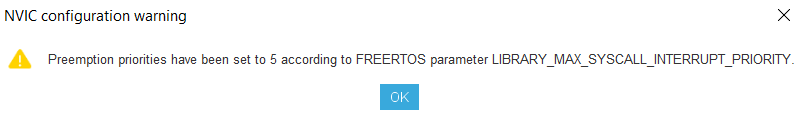

    As of now, this has not raised any noticeable issues.

Lastly, to prevent a seemingly mysterious error, `NVIC_SetPriorityGrouping( 0 );` must be added in initialization starting the RTOS kernel.

The global boolean variables for synchronizing our application code with the USB's interrupts described in the [USB in a Baremetal Environment](#usb-in-a-baremetal-environment) section still applies. Finally, we can initialize our own thread to make use of the USB flash drive.

```C++
// 3rd Party Libraryes and Frameworks
#include "cmsis_os.h"
#include "fatfs.h"
extern char USBHPath[4];   /* USBH logical drive path */
extern FATFS USBHFatFS;    /* File system object for USBH logical drive */
extern FIL USBHFile;       /* File object for USBH */
#include "usb_host.h"

// DFR Custom Dependencies
#include "app.hpp"
#include "Application/FileSystem/fat_fs.hpp"

osThreadId_t dataLoggingTaskHandle;
const osThreadAttr_t dataLoggingTask_attributes = {
  .name = "dataLoggingTask",
  .stack_size = 128 * 17,
  .priority = (osPriority_t) osPriorityNormal,
};

void RtosInit() {
	dataLoggingTaskHandle = osThreadNew(DataLoggingThread, NULL, &dataLoggingTask_attributes);
}

int cppMain() {
    NVIC_SetPriorityGrouping( 0 );
	osKernelInitialize();	// Initialize scheduler
	RtosInit();				// Initialize thread
	osKernelStart();		// Start scheduler

    // The remaining code in this function is never reached as it is overtaken by the kernel.
    // The threads are running instead.

    for(;;) {
        
    }

    return 0;
}

void DataLoggingThread(void *argument) {
	MX_USB_HOST_Init();

    // Initialize our FatFs wrapper class
    application::FatFs file_system(USBHPath, USBHFatFS, USBHFile);

    for (;;) {
        if(to_log == 1) {
            printf("Logging to USB\n");
            file_system.Mount();

            // Perform operations
            
            to_log = 0;

        } else if (to_unmount == 1) {
            file_system.Unmount();
            to_unmount = 0;
            printf("USB ejected\n");
        }
    }

    return 0;
}
```

Here, two threads are running:

- The hidden `USBH_Thread`, and
- Our `DataLoggingThread`.

### SDIO

Theoretically, our `FatFs` wrapper class should be functional for logging to a micro-SD card using through the SDIO communication protocol. 

Recall that the USB implementation leverages externally defined variables. These are defined by the FATFS library.

Defined in `fatfs.c`:

```C
#include "fatfs.h"

uint8_t retUSBH;    /* Return value for USBH */
char USBHPath[4];   /* USBH logical drive path */
FATFS USBHFatFS;    /* File system object for USBH logical drive */
FIL USBHFile;       /* File object for USBH */
```

Exposed in `fatfs.h`: and defined in `fatfs.c`:

```C
extern uint8_t retUSBH; /* Return value for USBH */
extern char USBHPath[4]; /* USBH logical drive path */
extern FATFS USBHFatFS; /* File system object for USBH logical drive */
extern FIL USBHFile; /* File object for USBH */
```

Used inn our `Program/Src/app.cpp`:

```C++
#include "fatfs.h"
extern char USBHPath[4];   /* USBH logical drive path */
extern FATFS USBHFatFS;    /* File system object for USBH logical drive */
extern FIL USBHFile;       /* File object for USBH */

application::FatFs file_system(USBHPath, USBHFatFS, USBHFile);
```

However, unlike with the USB implementation, the variables expected to be passed to the constructor may have to be manually defined. This is the justification for expecting these parameters to be passed via the constructor instead of being internally hidden. It is up to the consumer of this library to provide these necessary inputs.

If SDIO is ever to be re-implemented, ControllersTech's [Interface SD Card with SDIO](https://controllerstech.com/interface-sd-card-with-sdio-in-stm32/) article and video may be a great reference.

#### Hardware

[Device Primary Guide :octicons-book-16:](https://learn.adafruit.com/adafruit-microsd-spi-sdio){ .md-button }

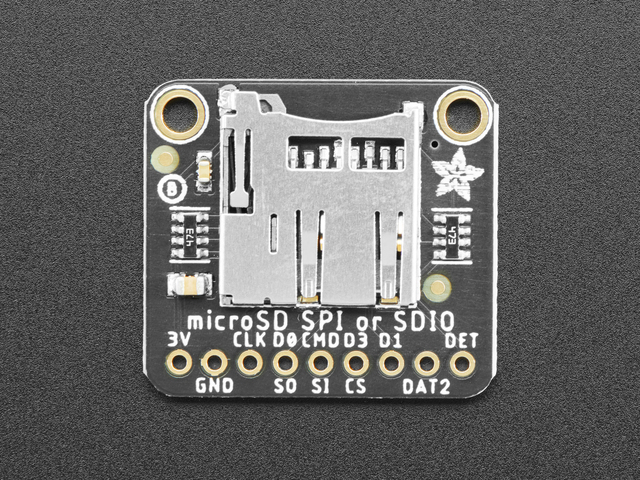{ width="300"; align=right }

- **Device**: [SDIO Breakout Board](https://www.adafruit.com/product/4682) by Adafruit.

#### Pinout

| Nucleo F446RE |   Breakout Board    |
|:-------------:| :-----------------: |
|      PC8      | DAT0                |
|      PC9      | DAT1                |
|      PC10     | DAT2                |
|      PC11     | DAT3                |
|      PC12     | CLK                 |
|      PD2      | CMD                 |
|      PB6      | CD (Card Detection) |

## Firmware Component Library

[Library API Docs :material-library:](#){ .md-button }

[Source Code :material-file-code:](){ .md-button }

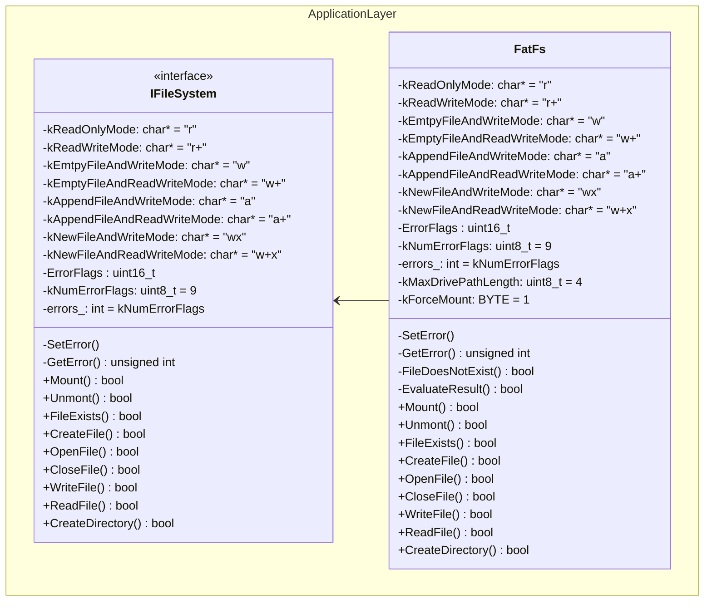

### How to Use

Before beginning operations on files and directories, it is important to mount the block device onto the file system. Also, before ejecting the block device, it must be unmounted.

!!! example
    Mounting the block device before beginning file/directory operations.

    ```C++
    int cppMain() {
        MX_USB_HOST_Init();
        application::FatFs file_system(USBHPath, USBHFatFS, USBHFile);
        file_system.Mount();

        // Perform file/directory operations

        file_system.Unmount();
        return 0;
    }
    ```

Files and directories can be created in any format to suite the user, provided that the file path is maintained. 

!!! example
    Creating folders and sub-directories.

    ```C++
    int cppMain() {
        MX_USB_HOST_Init();
        application::FatFs file_system(USBHPath, USBHFatFS, USBHFile);
        file_system.Mount();

        char dir1_path[] = "/DIR1";
        file_system.CreateDirectory(dir1_path);

        char dir_file_path[] = "/DIR1/file1.txt";
        file_system.CreateFile(root_file_path);

        char subdir1_path[] = "/DIR1/SUBDIR1";
        file_system.CreateDirectory(subdir1_path);

        char subdir_file_path[] = "/DIR1/SUBDIR1/file2.txt";
        file_system.CreateFile(root_file_path);

        file_system->Unmount();
        return 0;
    }
    ```

    This result in the following file directory tree:

    ```
    Block device logical drive
    |-- DIR1/
        |-- file1.txt
        |-- SUBDIR1/
            |-- file2.txt
    ```

To interact with a file, it must first be opened. Then, it must be closed when finished.

!!! example
    Writing to a file.

    ```C++
    int cppMain() {
        MX_USB_HOST_Init();
        application::FatFs file_system(USBHPath, USBHFatFS, USBHFile);
        file_system.Mount();

        char root_file_path[] = "/ROOTFILE.txt";
        file_system.CreateFile(root_file_path);
        file_system.OpenFile(root_file_path, (char*)"a");
        file_system.WriteFile((char*)"Hello World");
        file_system.CloseFile();

        file_sytem.Unmount();
        return 0;
    }
    ```

    To understand why the `"a"` flag is provided as an argument to `OpenFile()`, see the [POSIX-Compliant Flags](#posix-compliant-flags) section.

It is possible to search for a file and determine whether it exists. Similar to the other functions, `FileExists()` provides a return status for the consumer of the library to handle appropriately for their specific use case.

!!! example
    Checking whether a specific file exists.

    ```C++
    int cppMain() {
        MX_USB_HOST_Init();
        application::FatFs file_system(USBHPath, USBHFatFS, USBHFile);
        file_system.Mount();

        bool is_found = file_system.FileExists((char*)"/ROOTFILE.txt");

        file_system.Unmount();
        return 0;
    }
    ```

!!! example
    Reading content from a file.

    ```C++
    int cppMain() {
        MX_USB_HOST_Init();
        application::FatFs file_system(USBHPath, USBHFatFS, USBHFile);
        file_system.Mount();

        uint8_t max_buffer_size = 10;
        char buffer[max_buffer_size];
        bool status = file_system.ReadFile(buffer);

        if (status) {
            printf(buffer);
        } else {
            printf((char*)"Reading failed!");
        }

        file_system.Unmount();
        return 0;
    }
    ```

    Here, we initialize a buffer capable of holding up to 10 characters.

Any file type is supported. To write to a CSV file, the column entries are separated with a comma `,` and row entries are separated with a new line `\n`.

!!! example
    Using the `IFileSystem` abstract interface to interact with `FatFs` to create and write a CSV file.

    ```C++
    int cppMain() {
        MX_USB_HOST_Init();
        std::unique_ptr<application::IFileSystem> file_system(nullptr);
        file_system = std::make_unique<application::FatFs>(USBHPath, USBHFatFS, USBHFile);
        file_system->Mount();

        char root_file_path[] = "/ROOTFILE.csv";
        file_system->CreateFile(root_file_path);

        char root_file_header_row[] = "LinPot1,LinPot2,AccX,AccY,AccZ\n";
        char root_file_contents[] = "2.3,2.45,2,9,200\n";
        file_system->OpenFile(root_file_path, (char*)"a");
        file_system->WriteFile(root_file_header_row);
        file_system->WriteFile(root_file_contents);
        file_system->WriteFile(root_file_contents);
        file_system->CloseFile();

        file_system->Unmount();
        return 0;
    }
    ```

    The `ROOTFILE.csv` file will contain the following:

    | Linpot1 | Linpot2 | AccX | AccY | AccZ |
    |:-------:| :-----: | :--: | :--: | :--: |
    |   2.3   |  2.45   |   2  |   9  |  200 |
    |   2.3   |  2.45   |   2  |   9  |  200 |


### POSIX-Compliant Flags

The `FileOpen()` method requires a valid POSIX-compliance flag for determining the access mode in which the file is to be opened with. This serves to translate between the common POSIX standard and the Fat FS byte flags [^3].

[^3]: The values in the *Fat FS* columns are combined into a single byte using the bitwise OR `|` operator.

|  POSIX  |                  Fat FS                 |
|:-------:| :-------------------------------------: |
| `"r"`   | `FA_READ`                               |
| `"r+"`  | `FA_READ` `FA_WRITE`                    |
| `"w"`   | `FA_CREATE_ALWAYS` `FA_WRITE`           |
| `"w+"`  | `FA_CREATE_ALWAYS` `FA_WRITE` `FA_READ` |
| `"a"`   | `FA_OPEN_APPEND` `FA_WRITE`             |
| `"a+"`  | `FA_OPEN_APPEND` `FA_WRITE` `FA_READ`   |
| `"wx"`  | `FA_CREATE_NEW` `FA_WRITE`              |
| `"w+x"` | `FA_CREATE_NEW` `FA_WRITE` `FA_READ`    |

### Error Setting

Fat FS supports the following status values, defined by `FRESULT` in their `ff.h` file.

```C
/* File function return code (FRESULT) */

typedef enum {
	FR_OK = 0,				/* (0) Succeeded */
	FR_DISK_ERR,			/* (1) A hard error occurred in the low level disk I/O layer */
	FR_INT_ERR,				/* (2) Assertion failed */
	FR_NOT_READY,			/* (3) The physical drive cannot work */
	FR_NO_FILE,				/* (4) Could not find the file */
	FR_NO_PATH,				/* (5) Could not find the path */
	FR_INVALID_NAME,		/* (6) The path name format is invalid */
	FR_DENIED,				/* (7) Access denied due to prohibited access or directory full */
	FR_EXIST,				/* (8) Access denied due to prohibited access */
	FR_INVALID_OBJECT,		/* (9) The file/directory object is invalid */
	FR_WRITE_PROTECTED,		/* (10) The physical drive is write protected */
	FR_INVALID_DRIVE,		/* (11) The logical drive number is invalid */
	FR_NOT_ENABLED,			/* (12) The volume has no work area */
	FR_NO_FILESYSTEM,		/* (13) There is no valid FAT volume */
	FR_MKFS_ABORTED,		/* (14) The f_mkfs() aborted due to any problem */
	FR_TIMEOUT,				/* (15) Could not get a grant to access the volume within defined period */
	FR_LOCKED,				/* (16) The operation is rejected according to the file sharing policy */
	FR_NOT_ENOUGH_CORE,		/* (17) LFN working buffer could not be allocated */
	FR_TOO_MANY_OPEN_FILES,	/* (18) Number of open files > _FS_LOCK */
	FR_INVALID_PARAMETER	/* (19) Given parameter is invalid */
} FRESULT;
```

To abstract this away, while still maintaining error values that provide context of where something may have failed, an enum along with bitfields were defined in the `IFileSystem` interface.

```c++
enum class ErrorFlags : uint16_t {
    Mounting		= 1 << 0,
    Unmounting		= 1 << 1,
    FileNotFound	= 1 << 2,
    CreateFile		= 1 << 3,
    OpenFile		= 1 << 4,
    ReadFile		= 1 << 5,
    WriteFile		= 1 << 6,
    CloseFile		= 1 << 7,
    CreateDirectory = 1 << 8
};

static constexpr uint8_t kNumErrorFlags = 9;
unsigned int errors_ : kNumErrorFlags;

void SetError(ErrorFlags flag) {
    errors_ |= static_cast<uint16_t>(flag);
}

unsigned int GetError(ErrorFlags flag) {
    return errors_ & static_cast<uint16_t>(flag);
}
```

This allows `SetError()` to be utilized by our `FatFs` wrapper class when evaluating the success/failure of an operation indicated by `FRESULT` — a status indicator that is specific to their library.

!!! warning
    For maintaining the `errors_` bitfield, the `kNumErrorFlags` must match with the mount of entries in the `ErrorFlags` enum. This constant must be updated appropriately if flags are added/removed from `ErrorFlags`.
