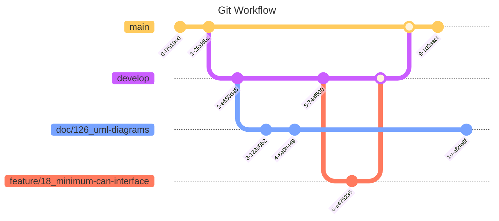

# Contributing and Version Control

This page was last updated: *{{ git_revision_date_localized }}*

## Branching Strategy

- To contribute to the codebase, create your branch from `develop`.
- Then, raise a Pull Request (PR) — or, Code Review — to have your work critiqued and polished. Once the new branch is ready, it will be finally merged to `develop`.
- All project developers will be mostly sharing each other's work through the `develop` branch.
- The `develop` branch will occassionally be merged into `main` as a means of publishing a new release or iteration of the project.

## General Format
`label/[task-number]_task-name`

## Flag Labels
* `feature/`
* `refactor/`
* `bug/`
* `docs/`

## Creating a New Branch

* Pre-pend the associated flag label.
* Separate the issue number and task name with an underscore `_`
* For the task field, use Camel Case
* For the sub-task field, use hyphens `-`

!!! example

    Consider a new firmware component, the ECU. Looking at the [CAN Interface issue](https://github.com/DallasFormulaRacing/DataAcquisition2.0/issues/18) on the project board, we can deduct the following:
    
    * **Issue ID Number**: 18 — found next to the title, denoted by `#`.
    * **Labels**: This is a feature, and contributes to the ECU.

    Branching from `develop`, our new branch can be `feature/18_minimum-can-interface`

## Things to Keep in Mind
* Using slashes `/` in branch names makes a nice drop-down structure of your branches on your GUI Git application (GitHub Desktop, SourceTree, GitKraken, etc). 🎊
* Auto-generated numbers from creating an issue will ensure we always have unique branch names. Our efforts will be associated with the correct issue accordingly in the long-term for traceability.
* Issues are found in the GitHub project board.
