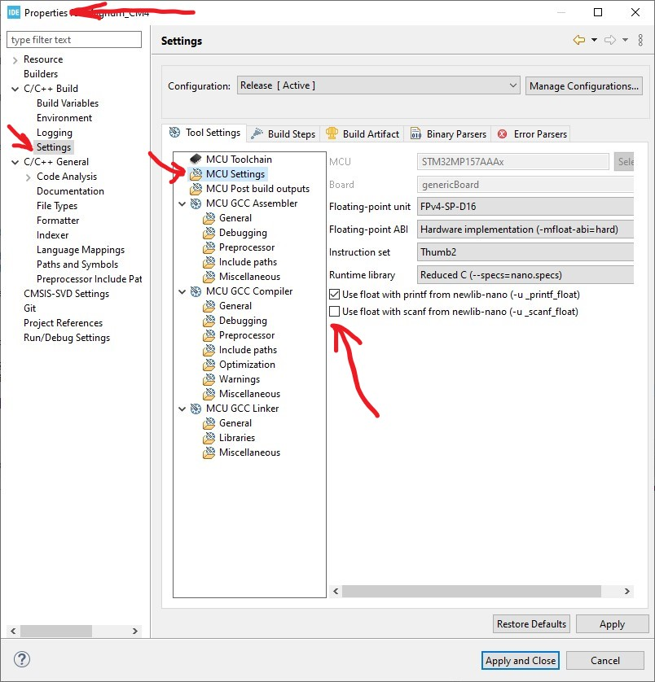
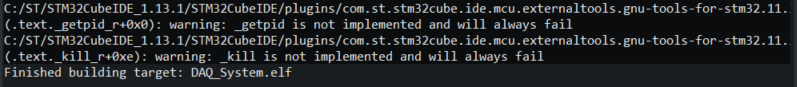
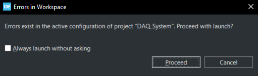
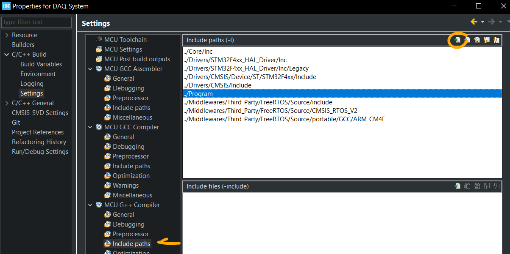
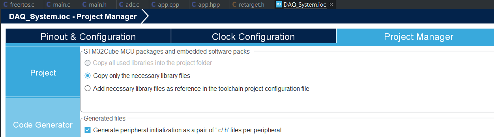

# IDE Project Settings

This page was last updated: *{{ git_revision_date_localized }}*

## CubeIDE Settings
Configurations we made to the compiler or project through CubeIDE.

### `printf()` Retargeting
- Via UART/USART: Shawn Hymdel's article, [How to Use printf on stm32](https://shawnhymel.com/1873/how-to-use-printf-on-stm32/).
- Remove `syscall.c` from build.
- Uses `UART_HAL_Transmit()` when overriding the C library functions.
- Make sure to add the `RetargetInit()` function.

Note that `printf()` is not ideal for use in an RTOS environment. A lot of C features are not thread-safe.

### Enabling Floating Point Values for `printf()`
Right-click project > Properties > C/C++ Build > Settings > MCU Settings > Enable `Use float with printf from newlib-nano (-u _printf_float)`



This caused the following errors/warnings:





To fix this, the following functions were added to the `retarget` files with empty implementations:
- `_getpid()`
- `_kill()`
- `_exit()`

!!! warning

    Although this enables floating point values for printing, the floats are printed on the serial console only if the firmware is compiled/flashed with CubeIDE.

### Separating C & C++
- Reference article: [Where to add new h and cpp file in stm32cubeide project](https://stackoverflow.com/questions/68306194/where-to-add-new-h-and-cpp-file-in-stm32cubeide-project)
- Creating a separate `Program/` folder with `app.hpp` and `app.cpp` that contains a new super loop function to escape from the auto-generated `main.c` super loop.
- Right-click Project > Properties > C/C++ Build > Tool Setting (tab) > MCU GCC Compiler or MCU G++ Compiler > Include paths
- For C++ files, change the Include Paths config for the G++ compiler instead of the GCC compiler



Then, you may get an "undefined reference" error for the calling code. In this case, `cppMain()` had an undefined reference, despite the `#include ""` lines and changing the Include Paths settings of the compiler.
- Reference article: [Undefined reference to function stm32cubeide](https://pcbartists.com/firmware/stm32-firmware/undefined-reference-to-function-stm32-cubeide-solution/)
- Right-click Project > Properties > C/C++ General > Paths and Symbols > "Source Location" tab > Add Folder


Finally, you may need to add `extern` guards. In this case because C++ code was calling for `retarget.h`, a C file, the following changes was made:
```C
// All credit to Carmine Noviello for this code
// https://github.com/cnoviello/mastering-stm32/blob/master/nucleo-f030R8/system/include/retarget/retarget.h

#ifndef _RETARGET_H__
#define _RETARGET_H__

#ifdef __cplusplus
extern "C" {
#endif

// The rest of the code
...

#ifdef __cplusplus
}
#endif

#endif //#ifndef _RETARGET_H__
```

## CubeMX Settings
Configurations we made to `.ioc` configs for code generation through CubeMX.

### Code Generator
- To split the auto-generated code on a per-peripheral basis, open the `.ioc` file > Project Manager > Code Generator > Enable `Generate peripheral initialization as a pair of '.c/.h' files per peripheral`



### Analog
#### ADC1
- Enable `IN0` (channel 0)
- Continuous Conversion: `Enabled`

### System Core
#### Sys
- Timebase Source: `TIM6`
  - FreeRTOS uses SysTick, which is the default timer for this setting. So this was changed as TIM6 and TIM7 are more power-friendly.

### Middleware
#### FreeRTOS
- Default task is left alone (CubeMX does not allow removing this task).
