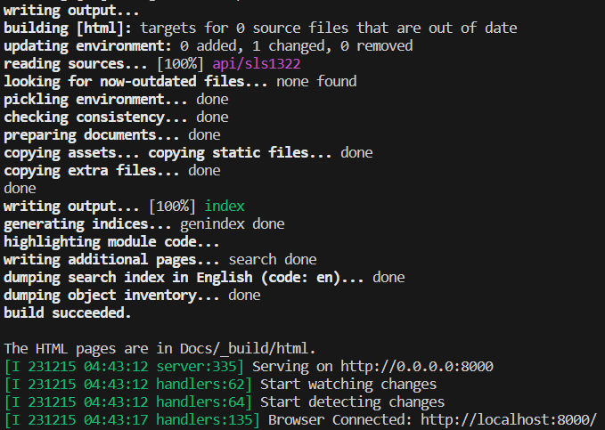

# Source Code Docs

This page was last updated: *{{ git_revision_date_localized }}*

## How it Works

Three tools are used for our API documentation:

- [Doxygen](https://www.doxygen.nl/manual/starting.html) — A standardized tool for generating docs by scanning C/C++ source code.
- [Sphinx](https://www.sphinx-doc.org/en/master/) — A more modernized documentation tool.
- [Breathe](https://breathe.readthedocs.io/en/latest/index.html) — For connecting Doxygen and Sphinx together.

Doxygen does a great job, and is reliable — but looks somewhat outdated. For a fresh look, Sphinx is used by building the final HTML pages. Doxygen has been configured to generate XML files in addition to HTML files. Breathe will take these XML files as an input and somehow allows Sphinx to generate HTML pages. This offers us the following benefits:

- Using a `sphinx-build` command instead of creating a build system with CMake or Makefiles.
- Flexible personalization of themes and colors.
- Enabling auto-building and serving with an HTTP server using the [sphinx-autobuild](https://github.com/executablebooks/sphinx-autobuild) tool.

## Generating & Viewing Documentation

Move into the [DAQ-Firmware-Libraries sub-module repo](https://github.com/DallasFormulaRacing/DAQ-Firmware-Libraries).

```
cd ./Project/DAQ_System/Program/DFR_Libraries
```

Build the Docker image:
```
docker build -t ubuntu-docs-image ./Docs
```


### Auto-build with HTTP Server

Create and start the container with auto-build:
```
docker run --rm -it --init -p 8000:8000 --name daq-docs-container -v .:/Project ubuntu-docs-image
```

- Changes to doc files (`.rst` or `.md` files) will be automatically re-built and displayed.
- When done, cancel the process with `Ctrl+C`. This will delete the container and stop serving the doc pages on port 8000.
- Note that this command must be re-run if making changes to the doc comments in the source code.

If successful, you will see some output that is similar to the following:



- You will now have newly generated docs as HTML files in `Project/Docs/_build/html`.
- The main landing page is `index.html`.
- To view the doc pages, go to [localhost:8000](http://localhost:8000/) in your browser.
- Alternatively, the [Live Preview](https://marketplace.visualstudio.com/items?itemName=ms-vscode.live-server) VSCode extension may be more performant. You can then view the docs by right-clicking `index.html` and selecting "Show Preview." The resulting VSCode window can be popped out into your browser.
- Alternatively, you can manually open the HTML files on Chrome through the file explorer.


### Manual Build

As opposed to using Docker to build and serve the docs to you, you can build the docs manually inside the container.

Create and start container:
```
docker run --entrypoint=/bin/bash -itd -p 8000:8000 --name daq-docs-container -v .:/Project ubuntu-docs-image
```

- Here, the container is not automatically deleted.
- The container is overwritten to do nothing (using `--entrypoint-/bin/bash`) instead of the starting command (specified with `CMD []` at the end of the Dockerfile

Enter the container:
```
docker attach daq-docs-container
```

Move into the Docs directory:
```
cd Docs
```

Re-build docs:
```
sphinx-build . ./_build
```

When you are done, type `Ctrl+D` to exit the container.


Note that you can run the following command for auto-building:

```
sphinx-autobuild --re-ignore xml/ --port 8000 --host 0.0.0.0 Docs Docs/_build/html
```
- This is the command automatically used when the docker container starts if you were to follow the [Auto-build](#auto-build) approach.
- Must be used in the `Project/` directory, unless you change the parameters.

### Manual Makefile Build

!!! danger
    
    The `sphinx-build` command approach is highly suggested as the following approach will soon be deprecated.

Sphinx has reported that the Makefile may be going deprecated. So, the `sphinx-build` command tool is preferred.

Clean old previous builds:
```
make clean
```

Generate docs:
```
make html
```


