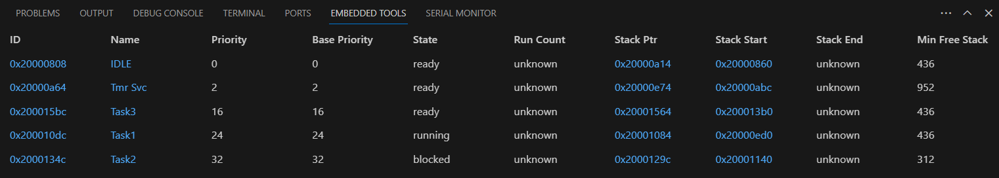
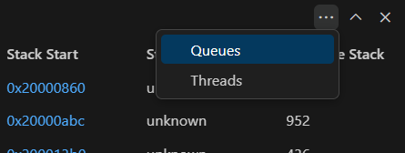
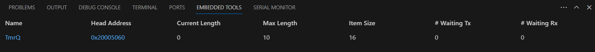
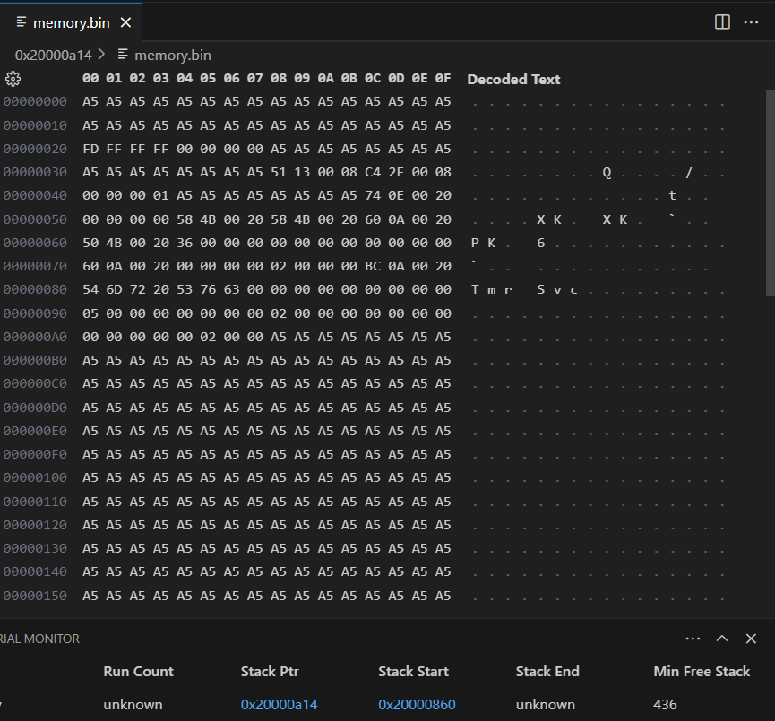
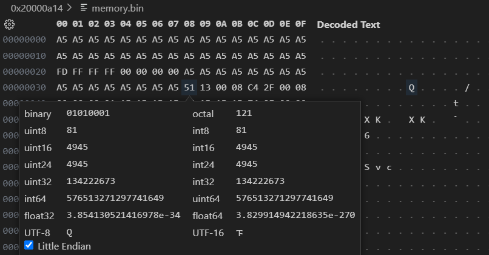
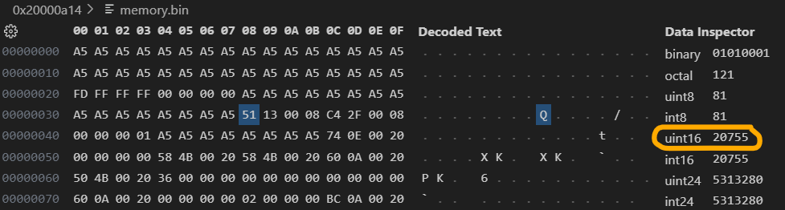
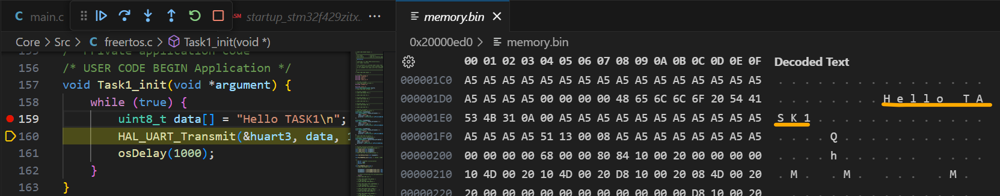

# Viewing RTOS Threads, Queues, and Memory

This page was last updated: *{{ git_revision_date_localized }}*

- Start a debugging session.
- Open the **Embedded Tools** tab in the terminal.

## Threads
- The RTOS Viewer provides threads by default.

## Queues
- Click the ellipses at the top-right corner of the terminal and select **Queues**.

## Viewing Memory
- Clicking on the hex values of an associated thread/queue will allow you to inspect the memory contents.
- You may be prompted to install the Hex Editor extension.

!!! example

    - Clicking on the address of the Stack Ptr, `0x2000 0a14`, belonging to the `IDLE` thread yields the following contents.
    - The accompanying Decoded Text corresponds to the Memory Map.
    - You can configure whether to show the Decoded Text and how many bytes to display per row using the settings button on the top-left corner of the memory map.

!!! example

    Let's look at the contents of `0x0000 0038`. You can hover your mouse over it or click it.
    
    - The contents of it is displayed as hex `0x51`.
    - The contents reveal that, as a `uint8` integer, this value is decimal `81`.
    - Hex `0x51` is decoded to ASCII `Q` in UTF-8.
    - Note that you can enable/disable Little Endian

But how is the data decoded for the other data types, such as `uint16`? Inspect the binary values of two addresses at a type. One pair of hex digits equates to two bytes (i.e., only 8 bits). Inspect the contents of `0x0000 0039`. Concatenating the binary values stored here with the binary values from `0x0000 0038` while Little Endian is disabled: `0x01010001 00010011` yields a `uint16` integer value of decimal 20755, which is shown when inspecting `0x0000 0038` (also known as, `0x51`).

Enabling Little Endian should require the concatenation to be swapped: `0x00010011 01010001` yields a `uint16` integer of 4945. We can verify this by inspecting `0x0000 0038`.

!!! example

    - In the Task1 thread, a byte array `data` is initialized with `Hello TASK1\n`.
    - To find this in memory, click on the Stack Start address (`0x2000 0ed0`) of the Task1 Thread.
    - You will find the decoded ASCII characters in the Decoded Text area.

