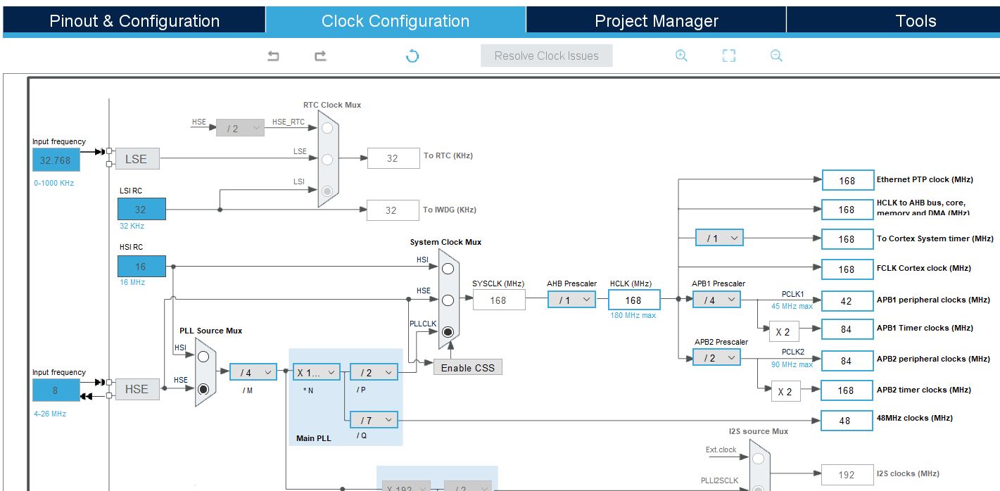
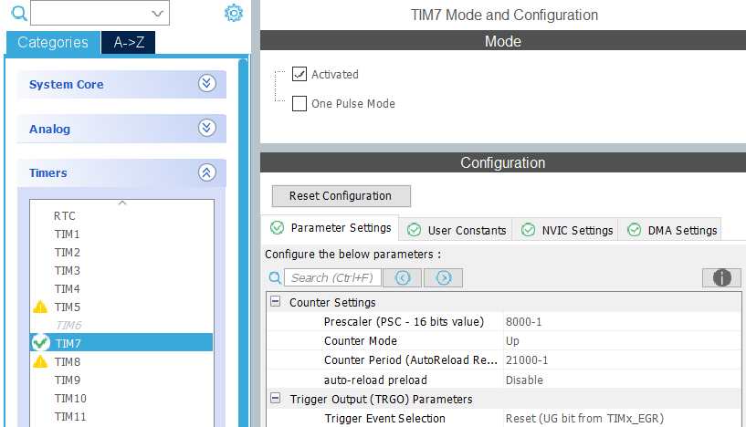
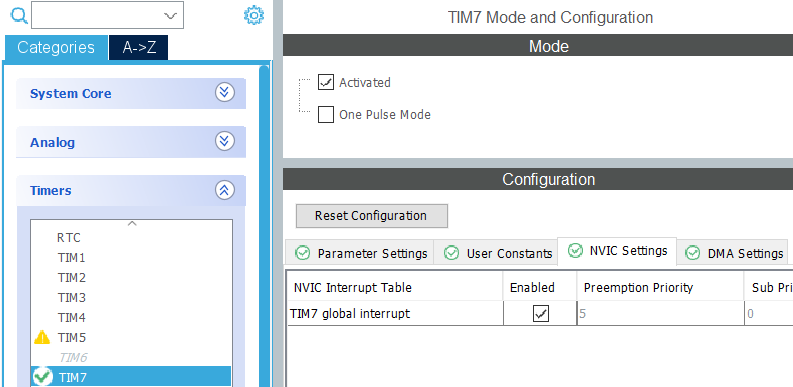
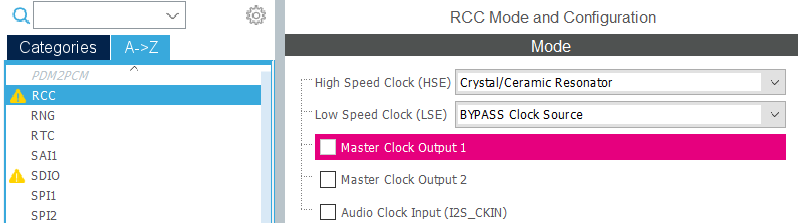

# Timing and Concurrency

This page was last updated: *{{ git_revision_date_localized }}*

## Hardware Timer

!!! note
	Currently, due to the implementation of CubeMx's auto-generated timer callback functions, the hardware timer is not abstracted away and is not kept as a component of the Platform layer. It is minimally implemented in `main.c`. 

The DAQ needs an accurate timer to periodically create timetamps that are to be associated with a new data sample. RTOS timers are not simple to implement, but have a less consistent precision. A hardware timer is utilized to meet this requirement.

The first step to enabling a hardware timer is to identify the bus it is attached to. A timer's frequency is initially subjected to the frequency of the bus it belongs to. Depending on the implementation of the microcontroller chip, different timers may be attached to different busses. This is platform-dependent.

Before continuing, make sure to have a specific timing deadline at which the timer interrupt signal will fire. This will be a parameter for the following calculations.

$$
Bus \ frequency / Prescaler \ value = Clock \ rate
$$

$$
(Time \ deadline)(Clock \ rate) = Number \ of \ steps \ or \ ticks
$$

The microcontroller may come with a *prescaler*, which divides the bus frequency to slow down the rate of the clock. This allows for adjusting the possible range of possible timing deadlines.

With a known time deadline, the clock rate can be utilized to determine the total number of clock ticks until it reaches the deadline. Once the number of ticks is reached, the timer will fire the interrupt signal and the pre-determined time deadline. That is, this is the number of ticks required for performing a single periodic interval.

!!! tip
	Increasing the prescaler and/or number of steps will lengthen the amount of time we can measure with a clock.

### STM32 Example

Currently, the DAQ uses the `TIM7` timer peripheral. This is attached to the APB1 bus. So, $Bus \ frequency = 84 MHz$.

For simplicity, we will make the clock tick roughly about 10 KHz. That is, we will divide the bus frequency by 8,000. So, $Prescaler \ value = 8,000 - 1$.

Then, compute: $(Bus \ frequency) / (Prescaler \ value) = (84,000,000) / (8,000 - 1) = 10,501 = Clock \ rate$

Say we want the DAQ to to create its timestamp every 2 seconds. Compute: $(Time \ deadline)(Clock \ rate) = (2 \ seconds)(10,501) = 21,002 = Number \ of \ steps \ or \ ticks$

Take note of the prescaler value and the number of ticks. These values will be used in CubeMx. Note that we entered their rounded values.

Enable the timer signal to trigger an interrupt.

Enable the following modes for the RCC peripheral.

!!! success
	You can learn further more on [DigiKey's Getting Started with STM32 - Timers and Timer Interrupts](https://www.digikey.com/en/maker/projects/getting-started-with-stm32-timers-and-timer-interrupts/d08e6493cefa486fb1e79c43c0b08cc6) tutorial.

## RTOS

!!! note
	*Threads* and *tasks* are synonymous here.

### Multi-threading

- Each firmware component is dedicated its own thread. Therefore, each firmware component has its own dedicated super loop.
- Note that if the microcontroller only has 1 core, then only one thread will run at a time despite having numerous threads.
- List of threads:
  - One each for every sensor
  - Data logging
  - Time stamping

### Scheduling

- Task priorities enabled.
- Preemptive scheduling enabled: At every tick, the scheduler will check whether a higher-priority task is Ready to run. This will preempt over the currently running task and the processor will run the higher-priority task, putting a pause to the lower-priority task.
- Most threads run indefinitely in a forever-loop. However, the timestamping thread is an exception. By using CMSIS-RTOS V2's [Thread Flags](https://www.keil.com/pack/doc/CMSIS_Dev/RTOS2/html/group__rtx__evr__thread__flags.html) feature, this particular thread will run when the [Hardware Timer](#hardware-timer) signals it to.

!!! warning
	A logically higher-priority task is usually represented with a numerical value closer to 0. That is, the lower the priority number, the higher the priority.

!!! tip
	It is recommended for tasks that are responsible to provide fast interaction to the user to run fairly often. Components such as the `DataLogger` may benefit from being suspended less often in comparison to other threads.

!!! tip
	For determining which CMSIS-RTOS V2 features are safe to perform in an Interrupt Sub-Routine (ISR), you can check their [List of ISR-safe features](https://arm-software.github.io/CMSIS_5/latest/RTOS2/html/theory_of_operation.html#CMSIS_RTOS_ISR_Calls).

### Data Sharing

Two components are declared as global objects and shared among multiple threads: [DataPayload](./../Application/Data%20Logger/data_payload.md) and [CircularQueue](./../Application/Data%20Logger/circular_queue.md).

A single instance of a `DataPayload` object is updated by all sensor-reading threads. The time stamping thread will periodically create a copy of this object as a means of sampling, and associate a newly created timestamp with it. This new copy of `DataPayload` containing a timestamp is inserted into the `CircularQueue`.

Only two threads need to share the `CircularQueue`: the timestamping thread and the data logging thread. The `DataLogger` will check for a new instance of `DataPayload` to log. 

These two shared objects must be guarded by a mutex. Generally, with any shared resource, a thread should request for its access before making use of it. **A mutex forces the threads to use a shared resource in sequence (one at a time) instead of allowing them to interrupt each other and corrupt information**.

The timestamping thread has higher priority than the sensor threads due to its strict deadline. Using a mutex before accessing the shared `DataPayload` instance will prevent the timestamping thread from interrupting a sensor thread from when halfway to updating with a new sensor reading.

Using a mutex before accessing the shared `CircularQueue` will ensure the queue's status of whether it is full or empty to be more accurate.

### Process Summary

sequence diagram with resource claiming

timing diagram with priorities and preemption