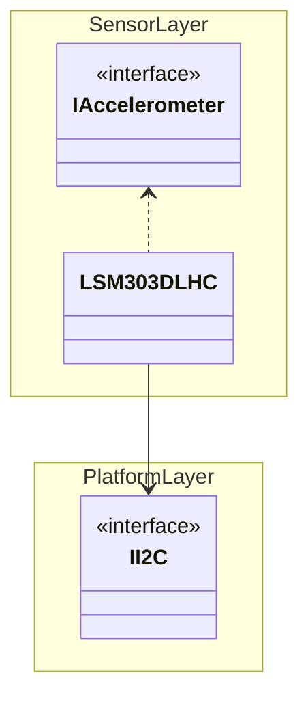

# Accelerometer

## Description

Reading the accleration in $G$s or $m/s^2$ of the X, Y, and Z axis.

## Supported Sensors

```mermaid
classDiagram

namespace SensorLayer {
    class IAccelerometer {
        <<interface>> 

    }

    class LSM303DLHC { }
}

namespace Platform Layer {
    class II2C {
        <<interface>>
    }
}

IAccelerometer <.. LSM303DLHC
LSM303DLHC --> II2C

link LSM303DLHC "lsm303dlhc/"

end
```