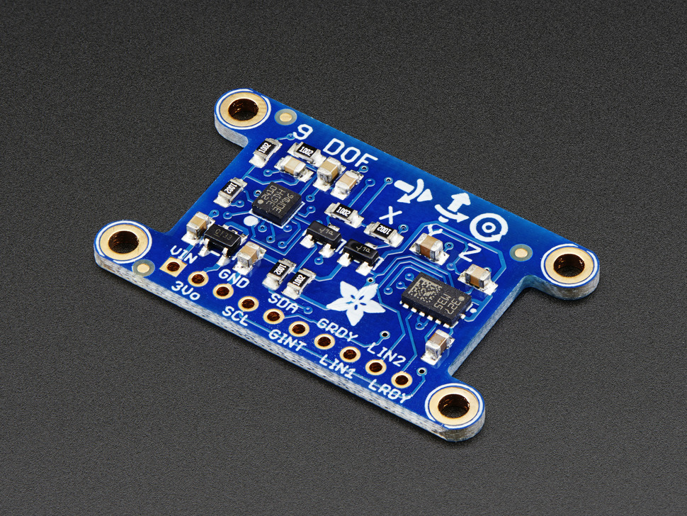

# LSM303DLHC

## Details

[Sensor Datasheet :octicons-book-16:](https://cdn-shop.adafruit.com/datasheets/LSM303DLHC.PDF){ .md-button }

{ width="300"; align=right }

- **Sensor**: [LSM303DLHC](https://www.adafruit.com/product/1714) Accelerometer.
    - Sensor is made by ST.
    - Breakout board is provided by Adafruit.
- **Frequency**:
- **Communication**: I2C.

## Pinout

## Firmware

[Library API Docs :material-library:](#){ .md-button }

### Calibration

- Digitally Representing &pm; 2G
- Averaged the magnitude of the sensor output for a period where it was not touched to find a correcting factor that would theoretically translate to 1.0G. After the program ran for several minutes, the average value for 1.0G was 1024. 
- Note that at this point, firmware has already been developed for converting raw data to m/s^2 and Gs
- This solution was by comparing the data read by the accelerometer to the data read from an iPhone accelerometer

### Addressing Drift
- Testing the sensor another day for drift, we found that the average output that day was less than when we first started testing than after running the accelerometer for a few minutes. 
- The correction value could change due to unknown external and internal conditions, it was decided that the sensor would need to be recalibrated during start-up and after running for certain periods of time. 
- The calibration function was created by taking the idea that an average of data taken for 100 loops while the sensor was restarted could be used as a correction value. If the minimum and maximum values of those samples had a deviation above 0.1G then the newly produced calibration factor would be thrown out on the assumption that the accelerometer is moving, and the calculated gravitational correction factor is incorrect. The calculated factor will then be thrown out and a predetermined default value will be used.
- This calibration value is produced by dividing the averaged array by the amount of samples as a conversion factor to "raw data per single G-force".

### How to Use

!!! example     
    How to initialize the `LSM303DLHC` object and read the acceleration of each axis by interacting with the `IAccelerometer` interface.
    ```c++
    #include <iostream>
    #include <memory>
    #include "mbed.h"
    #include "../iaccelerometer.hpp"
    #include "../accelerometer_lsm303dlhc.hpp"

    int main() {
    float* acceleration = nullptr;
    std::unique_ptr<adapter::IAccelerometer> accelerometer
        = std::make_unique<adapter::Accelerometer_LSM303DLHC>(I2C_SDA, I2C_SCL);

    accelerometer->init();

    while (true) {
        accelerometer->ComputeAcceleration();
        acceleration = accelerometer->GetAcceleration();

        //accelerometer values must be 
        std::cout << "ACC:" << 
                        "\tX: " << acceleration[0] <<
                        "\tY: " << acceleration[1] <<
                        "\tZ: " << acceleration[2] << std::endl;
        
        ThisThread::sleep_for(500ms);
    }
    }
    ```


### Registers

## Slave Address 
the LSM303dlhc contains a 7 bit address plus a read/write bit ad the end of the address. meaning that threre are two separate addresses for the lsm303dlhc and which one you use depends on whether you are wrting or reading to the sensor. the 7 bit address is 0011001 then you either add a 1 at the end to indicate a read (00110011) or add a 0 to indicate a write(00110010).
## CTRL Registers
The LSM303DLHC contains 6 Control registers that can be used to modify the characteristics of the accelerometer. However, the most important control register is CTRL_REG1_A. This register has an address of 0x20 and controls Output Data Rate(ODR), Low-power mode, and enabling each axis of the accelerometer. For basic configurations of the lsm303dlhc this is all you need to configure to begin recieving data.

!!! example
    A I2C register write to set 100 hz pooling rate, disable Low power mode, and enable all three axis. Note: this is a general idea for implemenation acutal code will vary.
     ```c++
     RegisterWrite(0x32,CTRL_REG1_A) // RegisterWrite(I2CWriteSlaveAddress, DataToWrite) 
     RegisterWrite(0x32,0x57) // 0x57(01010111) is the acutal data written to the regsiter 
     ```
      the example demonstrates two different write commands sent to the lsm303dlhc. The first the the address of the regsiter that is going to be written to and the second is the value that will be written to that said address. The other control registers handle different functions like a high pass filter, interupts, Full scale range (FSR), and much more.

### Output Registers
Data is received by registers that are denoted by OUT(OUT_X_L_A, OUT_Y_L_A, etc). each axis is comprised of a L and a H register(i.e OUT_X_L_A and OUT_X_H_A) which denotes the MSB and the LSB of the data ( Note: the endianness of the output can be altered with CTRL_REG4_A ). Which basically means that there will be 6 differnt registers for outputting data.

!!! example 
    The exmaple below is taken direclty from an implementation of the LSM303dlhc utilizing the STM32 HAL. 
    ```c++ 
    static constexpr int ByteArraySize = 6;
    static constexpr int I2CWriteSize = 1;
    static constexpr int I2CReadSize = 6;
    uint8_t command[1] = { OUT_X_L_A | 0x80 };

    HAL_I2C_Master_Transmit(&i2c_,ACC_ADDRESS, command,I2CWriteSize, HAL_MAX_DELAY);

    uint8_t bytes_received[ByteArraySize];
    HAL_I2C_Master_Receive(&i2c_,ACC_ADDRESS, bytes_received,I2CReadSize, HAL_MAX_DELAY);

    // 16-bit values
    raw_acceleration_data_[0] = (bytes_received[1] <<8 | bytes_received[0]);
    raw_acceleration_data_[1] = (bytes_received[3] <<8 | bytes_received[2]);
    raw_acceleration_data_[2] = (bytes_received[5] <<8 | bytes_received[4]);

    ```  

```c++
    uint8_t command[1] = { OUT_X_L_A | 0x80 };
```
This line of code is a unique property of the lsm303dlhc and other similar accelerometer. Since there are 6 register that need to be constantly read, Most accelerometers provide a way to do sequential reading. This is done by making the MSB bit of the registers address you want to read set to 1. With the MSB bit set to 1, the lsm303dhlc doesn't require any more addresses to be sent to through the I2C line, instead it will auto increment the addresss by 1 and send that data.

Each register is 8 bits but each axis needs 16 bits to fully realize the data which means that you will need an array of 6 to hold each data and each axis will need two elements to fully realize that data. The bottom section of the example code demonstrates how the two elements that make up on axis data can be combined into one variable.