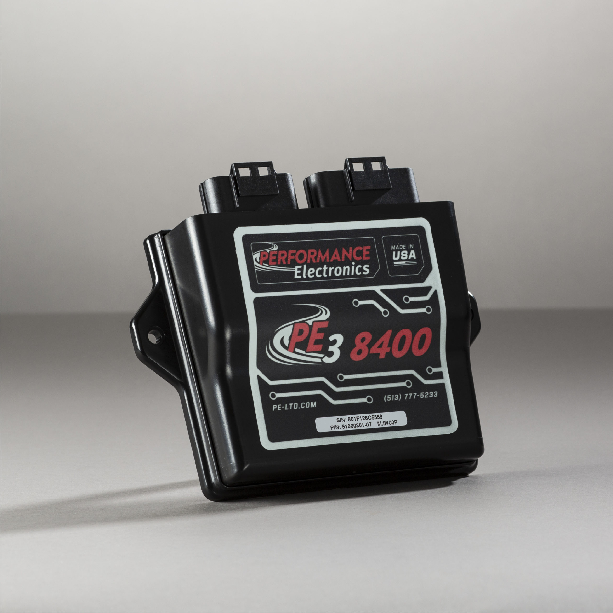
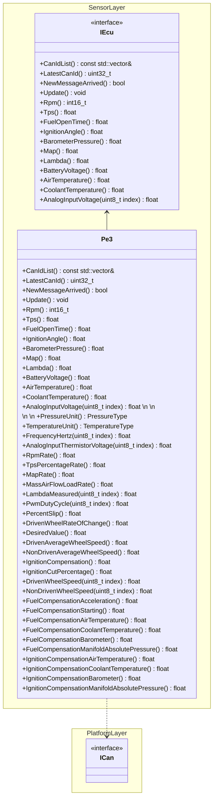
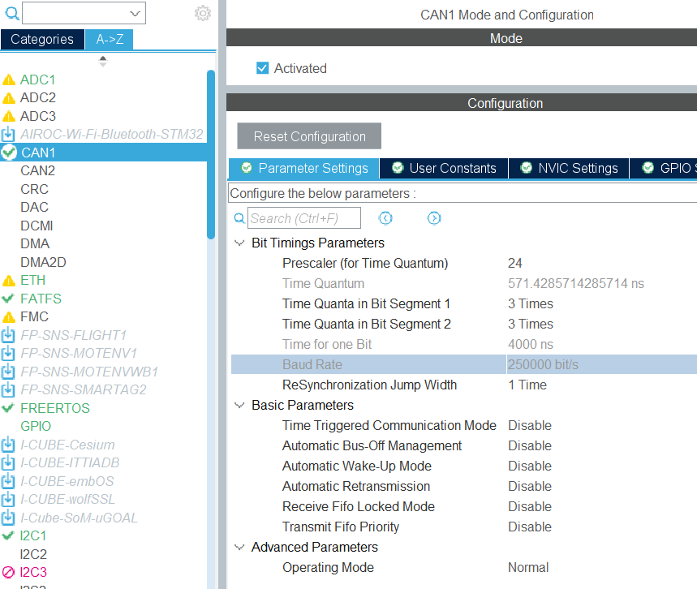
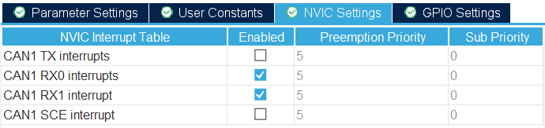
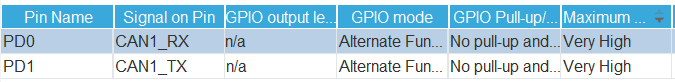
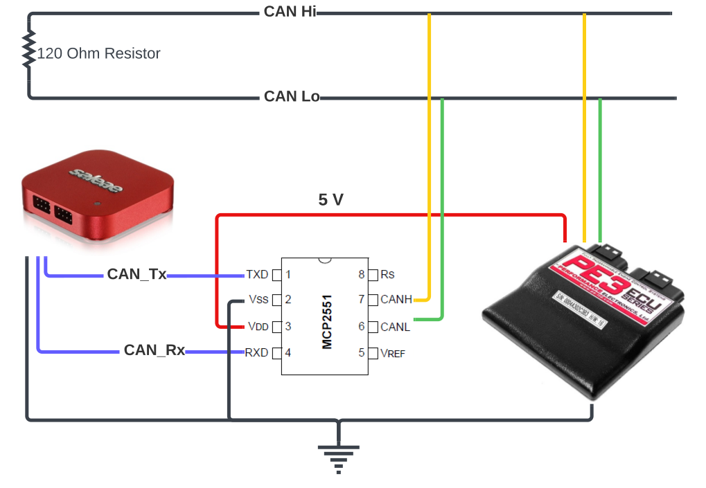

# PE3 8400P

This page was last updated: *{{ git_revision_date_localized }}*

## Details

{ width="250"; align=right }

[Device Datasheet :octicons-book-16:](https://pe-ltd.com/assets/AN400_CAN_Protocol_C.pdf){ .md-button }


- **Device**: [PE3-8400P](https://pe-ltd.com/product/pe3-8400p/) ECU by Performance Electronics.
- **Bit Rate**: 250 kbps. However, each message is published at different rates.
- **Communication**: Extended CAN.[^1] Based on the SAE J1929 standard.

[^1]: Extended CAN is synonymous to CAN 2.0B.

<br />
<br />
<br />

{ width="200"; align=right }

[Device Datasheet :octicons-book-16:](https://ww1.microchip.com/downloads/en/devicedoc/20001667g.pdf){ .md-button }

- **Device**: [MCP2551](https://www.microchip.com/en-us/product/mcp2551#purchase-from-store) CAN Transceiver by Microchip.
- **Communication**: Converting between single-ended and differential-pair signals.

<br />

!!! warning
    The MCP2551 transceiver is discontinued and deprecated. This was selected due to the higher availability of documentation.

## Circuit


!!! info
    This ECU internally has a $120 \Omega$ termination resistor,

### Pinout

| Transceiver |   MCU  |
|:-----------:| :----: |
|    VCC      |   5V   |
|    GND      |   GND  |
|    RXD      | CAN_RD |
|    TXD      | CAN_TD |


## Firmware Component Library

[Library API Docs :material-library:](#){ .md-button }

[Source Code :material-file-code:](https://github.com/DallasFormulaRacing/DataAcquisition2.0/tree/develop/Project/DAQ_System/Program/Src/Sensor/ECU/PE3){ .md-button }



### CAN Bus Reading Strategy

To make data available, the ECU component undergoes the following steps in order:

- The `ICan` interface feeds the byte array and CAN ID to the ECU.
- Check the CAN ID to identify the `FramePEx`.
- Create `FramePEx` by providing the byte array for parsing.
- Utilize the `FramePEx` methods to access the data.
- Store a local copy of the resulting data. 

### Nomenclature

We will refer to the following terms in correspondence to the [ECU datasheet](https://pe-ltd.com/assets/AN400_CAN_Protocol_C.pdf):

- Frame — A `PEx` message.
- Field — A data value encapsulated within a frame.
- Frame Format — The arrangement of bytes and bits representing each field.

Instead of defining similar, unique parsing algorithms for each individual frame, it was decided to categorize each frame by their formats in favor of maintaining only a shared set of common parsing algorithms.

### Message Formatting


#### Frame Format 1

| Data Field | Number of Bytes |
|:----------:| :-------------: |
|      1     |       2         |
|      2     |       2         |
|      3     |       2         |
|      4     |       2         |

#### Frame Format 2

| Data Field | Number of Bytes |
|:----------:| :-------------: |
|      1     |       2         |
|      2     |       2         |
|      3     |       2         |

#### Frame Format 3

| Data Field | Number of Bytes |
|:----------:| :-------------: |
|      1     |       1         |
|      2     |       1         |
|      3     |       1         |
|      4     |       1         |
|      5     |       1         |
|      6     |       1         |
|      7     |       1         |
|      8     |       1         |

#### Frame Format 4

| Data Field | Number of Bytes |
|:----------:| :-------------: |
|      1     |       2         |
|      2     |       2         |
|      3     |       2         |
|      4     |       1         |

#### Frame Format 5

| Data Field | Number of Bytes |
|:----------:| :-------------: |
|      1     |       2         |
|      2     |       2         |
|      3     |       1         |
|      4     |       1         |
|      5     |       1         |
|      6     |       1         |

!!! example
    
    The CAN message with a CAN ID of `0xCFFF148` would be referred to as *Frame PE2*. Notice that PE2 has four fields:

    - Barometer
    - MAP
    - Lambda
    - Pressure Type

    Observing the arrangements of fields and bytes, `FramePE2` seems to follow `FrameFormat4`. In other words, there are four data fields where fields 1-3 (Barometer, MAP, Lambda) are represented with 2 bytes while the last field (Pressure Type) is represented with only 1 byte.

### Field Parsing Algorithm

#### 2-Byte Fields

It is worth noting that for every `FrameFormatx`, the 2-byte fields are received before the 1-byte fields. Each `FrameFormatx` class internally defines a vector initialized at the length of the number of 2-byte fields. 

Having a known number of *byte pairs* and a known maximum length of 8 bytes in the receiving buffer (per the CAN standard) allows us to handle the indexes of each `FrameFormatx` class.

Each `FramePEx` class inherits its corresponding `FrameFormatx` along with its vector of fields. Upon receiving a byte array for input at initialization, the constructor of `FrameFormatx` is utilized to begin parsing each fields:

- Compute the `max_index` by halving the length of the `fields` vector.
- Iterate through the receiving buffer byte array:
    - Grab `LowByte` and `HighByte` from the receiving buffer, advancing the index accordingly.
    - Perform the [Byte Pair Parsing Algorithm](#byte-pair-parsing-algorithm).
    - Store the computed output into `fields`.

#### 1-Byte Fields

These fields are stored exactly as they were first received without modification. This occurs after [parsing 2-byte fields](#2-byte-fields).

#### 1-Bit Fields

For `FramePE2` and `FramePE6`, the final bit indicates the tempeature and pressure type, respectively.

This serves to mark if the temperature is being expressed as Fahrenheit/Celsius or the pressure as psi/Kilo-Pascal — depending on whether the type bit is low (`0x00`) or high (`0x01`).

### Byte Pair Parsing Algorithm

An Extended CAN Message can contain up to 8 bytes of data. The [ECU datasheet](https://pe-ltd.com/assets/AN400_CAN_Protocol_C.pdf) specifies that it may transmit data represented with two bytes: a *low* byte and a *high* byte. Within the stream of CAN messages, the *low* byte comes first and is then accompanied by the *high* byte.

!!! info

    This byte parsing algorithm applies only to data that are represented with two bytes. Those represented with only one byte are stored as they were received.

The datasheet defines 2-byte data to be stored as the following:

$$
Num = HighByte*256 + LowByte
$$

Multiplying by 256 is equivalent to bit-shifting the `HighByte` to the left by 8. This is simply combining to bytes into a 16-bit value.

The complete byte-parsing algorithm:

```
Num = HighByte*256 + LowByte
if (Num > 32767) then
    Num = Num - 65536
endif
```

The complete algorithm indicates that we must account for bit overflow. Having to prohibit `Num` from exceeding 32767 suggests that this is a **signed 16-bit integer** (Two's Complement). That is, the MSB represents the signage and the numerical value of the data is represented with the remaining 15 bits. Subtracting by 65536 is a means of resetting the value to its negative domain within the 15-bit range (-32768 to +32767).

$$
2^{15 \ bits} - 1 = 32767
$$

$$
2^{16 \ bits} = 2^{15 \ bits} * 2 = 65536
$$

Until bit overflow is accounted for, 32-bits are first allocated to store `Num`. Otherwise, in the case of bit overflow, unexpected values may occur. The final output is a 16-bit integer by masking.

### Field Computing

In the process of creating a `FramePEx`, only the following have occurred with the byte array of data from the CAN bus:

- The layout of fields have been identified, per the inherited `FrameFormatx`.
- The bytes of each field are parsed according to the frame's format.
- The results are **stored as integers** in the `fields` vector.

These steps are handled entirely by the `FrameFormatx` classes.

The final step to computing the final output is to multiply a value from `fields` with the field's corresponding `ResolutionPerBit` — as specified in the [ECU datasheet](https://pe-ltd.com/assets/AN400_CAN_Protocol_C.pdf). The `ResolutionPerBit` is field-specific, and therefore this last step is frame-specific and handled by the `FramePEx` class. The data is finally represented in its appropriate floating-point form as a field in a frame.

### How to Use

!!! example
    Reading from the PE3 ECU firmware component.

```C++
// Standard Libraries
#include <memory>

// DFR Custom Dependencies
#include "app.hpp"
#include "Platform/CAN/Interfaces/ican.hpp"
#include "Sensor/ECU/PE3/pe3.hpp"

void cppMain() {
    // Assume this pointer has initialized to a
    // CAN peripheral and all platform-specific
    // configurations have already been performed.
    std::shared_ptr<platform::ICan> can_bus;

    // Initialize the PE3 ECU
    auto pe3_ecu = std::make_unique<sensor::Pe3>(can_bus);

    float manifold_absolute_pressure = 0.0f;
	float battery_voltage = 0.0f;

    for(;;) {
        if (pe3_ecu->NewMessageArrived()) {
            // Disable interrupts here
			pe3_ecu->Update();
			uint32_t can_id = pe3_ecu->LatestCanId();

			switch(can_id) {
			case FramePe2Id:
				manifold_absolute_pressure = pe3_ecu->Map();
				break;

			case FramePe6Id:
				battery_voltage = pe3_ecu->BatteryVoltage();
				break;
			}
            // Re-enable interrupts here
		}
    }
}
```

!!! example
    Reading from the PE3 ECU firmware component through the `IEcu` abstract interface.

```C++
// Standard Libraries
#include <memory>

// DFR Custom Dependencies
#include "app.hpp"
#include "Platform/CAN/Interfaces/ican.hpp"
#include "Sensor/ECU/PE3/iecu.hpp"
#include "Sensor/ECU/PE3/pe3.hpp"

void cppMain() {
    // Assume this pointer has initialized to a
    // CAN peripheral and all platform-specific
    // configurations have already been performed.
    std::shared_ptr<platform::ICan> can_bus;

    // Initialize the PE3 ECU
    std::unique_ptr<sensor::IEcu> ecu(nullptr);
	ecu = std::make_unique<sensor::Pe3>(can_bus);

    float manifold_absolute_pressure = 0.0f;
	float battery_voltage = 0.0f;

    for(;;) {
        if (pe3_ecu->NewMessageArrived()) {
			pe3_ecu->Update();
			uint32_t can_id = pe3_ecu->LatestCanId();

            manifold_absolute_pressure = pe3_ecu->Map();
            battery_voltage = pe3_ecu->BatteryVoltage();
		}
    }
}
```

!!! warning
    It is worth noting that due to interacting with the ECU using the abstract interface, the identification of CAN IDs is lost because that is ECU-specific information. Therefore, `IEcu` is more suitable for polling operations, not for receiving CAN messages using interrupts.

    One solution for implementing interrupts despite having abstracted away specific CAN IDs, may be to implement the [Observer design pattern](https://www.modernescpp.com/index.php/the-observer-pattern/) or some form of callback functions. At the time of this writing, this is not supported.

## Current Integration

### Platform Implementation

The ECU component depends on an implementation of the `ICan` interface to interact with the hardware's CAN peripheral and expects the following inputs:

- A byte array of data from the latest CAN message.
- The corresponding CAN ID.

This is implemented with [`BxCan_StmF4`](../../Supported%20Platforms/STMicroelectronics/stmicroelectronics.md/#basic-extended-can) by using interrupt signals. To more efficiently process CAN messages, we are interacting with the `Pe3` class directly (without the `IEcu` interface) to retain access to the ECU-specific CAN IDs. The BxCAN peripheral's interrupt mode and CAN ID filters are configured before reaching the super-loop.

Note that the filters are configured by providing lower-bound and higher-bound values to specify a range for grabbing our desirable CAN ID. 

```C++
// Standard Libraries
#include <memory>
#include <vector>

// ST HAL Dependencies
#include "can.h"
extern CAN_HandleTypeDef hcan1;

// DFR Custom Dependencies
#include "app.hpp"
#include "Platform/CAN/STM/F4/bxcan_stmf4.hpp"
#include "Platform/CAN/Interfaces/ican.hpp"
#include "Sensor/ECU/PE3/iecu.hpp"
#include "Sensor/ECU/PE3/pe3.hpp"

// CAN Bus Interrupt Callback
std::shared_ptr<platform::BxCanStmF4> bx_can_callback_ptr(nullptr);

void HAL_CAN_RxFifo0MsgPendingCallback(CAN_HandleTypeDef *hcan) {
	bx_can_callback_ptr->ReceiveCallback();
}

using ReceiveInterruptMode = platform::BxCanStmF4::ReceiveInterruptMode;

void cppMain() {
    // Initialize the microcontroller's CAN peripheral
    auto bx_can_peripheral = std::make_shared<platform::BxCanStmF4>(hcan1);
	std::shared_ptr<platform::ICan> can_bus = bx_can_peripheral;

    // Initialize the Pe3 ECU
	auto pe3_ecu = std::make_unique<sensor::Pe3>(can_bus);
	const std::vector<uint32_t>& can_id_list = pe3_ecu->CanIdList();

	// Subscribe to messages with PE3's CAN IDs
	for (const uint32_t& can_id : can_id_list) {
		bx_can_peripheral->ConfigureFilter((can_id >> 13), (can_id & 0x1FFF));
	}

	bx_can_peripheral->Start();

	bx_can_callback_ptr = bx_can_peripheral;
	ReceiveInterruptMode rx_interrupt_mode = ReceiveInterruptMode::kFifo0MessagePending;
	bx_can_peripheral->ConfigureReceiveCallback(rx_interrupt_mode);
	bx_can_peripheral->EnableInterruptMode();

    for(;;) {
        // Process Pe3 data
    }
}
```

### CubeMX Settings

Most settings are left to their default configurations.

The Bit Timimng Parameters were configured until the Baud Rate matched that of the PE3: **250 kbps**, as specified by the [datasheet](https://pe-ltd.com/assets/AN400_CAN_Protocol_C.pdf).

<figure markdown>
  
  <figcaption>Bit timing parameters.</figcaption>
</figure>

<figure markdown>
  
  <figcaption>Enabling interrupt signals.</figcaption>
</figure>

<figure markdown>
  
  <figcaption>GPIO pin modes and assignments.</figcaption>
</figure>


## Data Capture

In favor of efficiency, this library was developed with a reverse-engineering approach. Data has been captured by using the [Saleae Logic 8](https://usd.saleae.com/products/saleae-logic-8) analyzer and recorded with the [Logic 2 Software](https://www.saleae.com/downloads/). This allowed us to inspect the data and verify how to parse the information properly before developing the firmware.

### Connecting to the CAN Bus

Saleae's pro analyzers may be able to read the voltages on the CAN bus (i.e., CAN Hi and Lo lines). In our case, we are unable to do this. However, that is only necessary if we wish to debug the CAN network.

Instead, the logic analyzer was connected to the single-ended signals (i.e., CAN Rx and Tx) with the transceiver. This was recommended in Salae's [User Guide](https://support.saleae.com/protocol-analyzers/analyzer-user-guides/using-can).



!!! tip

    Some oscilloscopes offer the feature to decode CAN messages.

### Sample Data

The following downloadable files contains sample data that can be opened through the [Logic 2 Software](https://www.saleae.com/downloads/) application:

- [Frames1to6.sal](./sample%20data/Frames1through6.sal){:download}
- [Frames7to16.sal](./sample%20data/Frames7toEnd.sal){:download}

!!! warning

    This data was captured while the vehicle remained stationary.

!!! success

    This sample data was used to develop automated [unit tests](https://github.com/DallasFormulaRacing/DataAcquisition2.0/blob/develop/Project/Tests/Src/Sensor/ECU/PE3/pe_frames_tests.cpp) for testing the parsing algorithm implemented in the firmware.


#### Regular Frame

!!! Example
    Parsing the byte-array stored in the Data field of a recorded CAN message holding the PE1 Frame.

$$
[ 0x1E, 0x05, 0xA5, 0x03, 0xFE, 0x00, 0x3C, 0x00 ]
$$

Following the steps of the field-parsing and byte-parsing algorithms, we begin by grabbing a pair of bytes. The first byte-pair `[0x1E, 0x05]` is associated to the first field of the PE1 frame: RPM. This equates to `[30, 5]` in decimal notation.

$$
\begin{aligned}
    Num &= HighByte * 256 + LowByte \\
    &= (5) * 256 + (30) \\
    &= \boxed{1310}
\end{aligned}
$$

$$
\begin{aligned}
    RPM &= Num * ResolutionPerBit \\
    &= = 1310 * (1) \\ 
    &= \boxed{1310}
\end{aligned}
$$

To parse the next field, TPS, we must parse the next byte-pair: `[0xA5, 0x03]`.

$$
\begin{aligned}
    Num &= HighByte * 256 + LowByte \\
    &= (0xA5) * 256 + (0x03) \\
    &= \boxed{933}
\end{aligned}
$$

$$
\begin{aligned}
    TPS &= Num * ResolutionPerBit \\
    &= 933 * (0.1) \\ 
    &= \boxed{93.3}
\end{aligned}
$$


This process is repeated for the rest of the byte array to parse the remaining fields (Fuel Open Time and Ignition Angle).

#### Pressure Unit

!!! Example
    Parsing the Data field of a recorded CAN message holding the PE2 Frame.

<figure markdown>
  
  <figcaption>PE2 Frame read on the logic analyzer.</figcaption>
</figure>

Parsing the Barometer, MAP, and Lambda fields of the PE2 frame follows the same process demonstrated in the previous example. However, note that this frame indicates the Pressure in PSI or Kilo-Pascal by encoding with only 1 bit. This bit is stored in the second-to-last byte of the CAN message's Data. In this case, `0x00` is received and therefore the pressure is expressed in PSI.

#### Temperature Unit

!!! Example
    Parsing the Data field of a recorded CAN message holding the PE6 Frame.

<figure markdown>
  
  <figcaption>PE6 Frame read on the logic analyzer.</figcaption>
</figure>

Likewise, the PE6 frame delegates a bit for expressing the temperature in Fahrenheit or Celsius. In this sample output, `0x00` is received and therefore the temperature is expressed in Fahrenheit.

