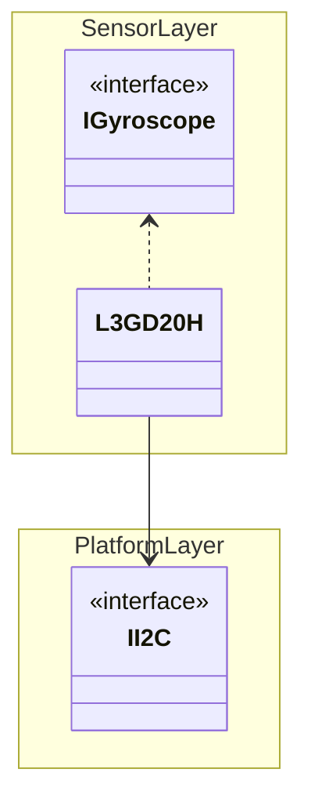

# Accelerometer

## Description

Reading the angular velocity in $\degree /s$ or $rad/s$ of the X, Y, and Z axis.

## Supported Sensors

```mermaid
classDiagram

namespace SensorLayer {
    class IGyroscope {
        <<interface>> 

    }

    class L3GD20H { }
}

namespace Platform Layer {
    class II2C {
        <<interface>>
    }
}

IGyroscope <.. L3GD20H
L3GD20H --> II2C

link L3GD20H "l3gd20h/"

end
```