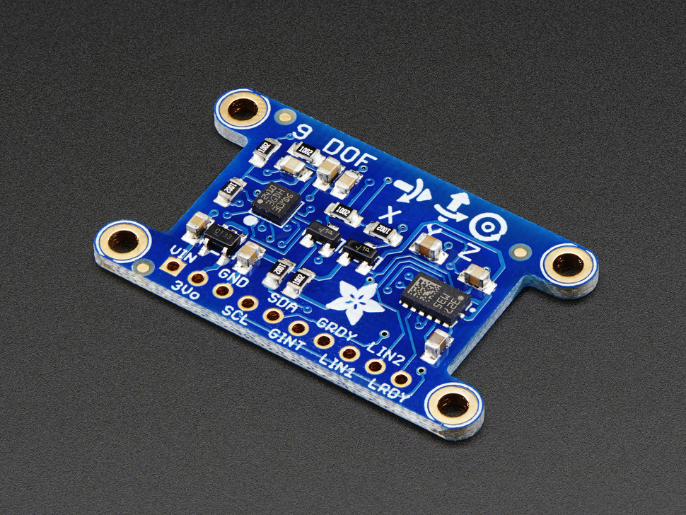

# L3GD20H

## Details

[Sensor Datasheet :octicons-book-16:](https://www.mouser.com/datasheet/2/389/l3gd20h-1849163.pdf){ .md-button }

{ width="300"; align=right }

- **Sensor**: [LSM303DLHC](https://www.adafruit.com/product/1714) Gyroscope.
    - Sensor is made by ST.
    - Breakout board is provided by Adafruit.
- **Frequency**:
- **Communication**: I2C.
- Senses rotations in the range of $-245 \ \degree /s$ to $245 \ \degree /s$


## Pinout

## Resources and Calculations

If you are too lazy to read here is the list of the main resources used in addition to resources used for researching gyroscope:

* https://github.com/adafruit/Adafruit_L3GD20/blob/master/Adafruit_L3GD20.cpp
* https://www.pololu.com/file/0J731/L3GD20H.pdf
* https://studylibfr.com/doc/10064916/lab-3---gyro-and-acc-lab--1-
* https://electronics.stackexchange.com/questions/205658/converting-raw-gyro-l3gd20h-values-into-angles

## Firmware

[Library API Docs :material-library:](#){ .md-button }

in order to obtain readable data from the gyroscope the raw data needs to be converted to DPS. The equation below demonstrates the conversion to DPS (the picture was from Adafruit's L3GD20 library from here https://github.com/adafruit/Adafruit_L3GD20/blob/master/Adafruit_L3GD20.cpp
)

 

the sensitivity that the library used depends on the selected DPS and can be found in the L3GD20H datasheet. The picture below shows the available sensitivities. ( link for the site: https://www.pololu.com/file/0J731/L3GD20H.pdf)


**_Note that sensitivity is in mDPS/digit so you need to convert it to DPS/digit by multiplying by 10^-3_**

### Remarks

This first remark isn't very important but I think it might be worth mentioning. generally, a whole iteration of the code will typically take around a few microseconds to fully iterate(specifically for the gyroscope code) . Normally this would be fine, however, each iteration of code needs data from the gyroscope to function properly. This is where to problem occurs, the default ODR for the gyroscope is around 100hz. Meaning that it has a period of around 10ms (1/100). this is found by looking in the L3GD20H datasheet


The register that keeps track of the ODR is seen below


The table that describes the different combinations of ODR can also be seen below


**_Note that LOW_ODR is disabled by default so you don't have to worry about that value_**

 Now when looking at all the default values for CTRL1( where ODR is changed)


looking at the default register value table and comparing it to the ODR table you can see that the default ODR is 100 Hz with a cutoff frequency of 12.5 Hz. my main concern is that the code is utilizing uncessary resources since it will iterate a whole loop significantly faster than the gyroscope can refresh its data. The problem wouldn't affect the results/data from the gyroscope but with some modification to the code we could potentially reduce the number of resources this code needs.

### Hardware Interrupt

This remark is more like a solution to my previous remark. The L3GD20H comes with two interrupts a programmable interrupt(INT1) and a data ready/fifo interrupt (INT2). Either of these interrupts could be used to eliminate unnecessary iteration of the code. 

### Saturation and Inconsistencies

When looking at the data sheets, the L3GD20H has a Full Scale of 245 DPS which is unusual since most gyroscopes are typically in 250 DPS. In addition to being at an odd DPS, the L3GD20H datasheet gives the same sensitivity of 8.75 mDPS/digit for the full scale. This sensitivity is typically used for 250 DPS like the Adafruit L3GD20 library( note that the L3GD20 uses 250 DPS while the L3GD20H uses 245 DPS). This is confusing since 245 DPS is not the same as 250 DPS so it's kind of weird that the datasheet uses the same sensitivity used for a full scale of 250 DPS. Leading to my remark, when I max out the gyroscope, it maxes out at around 280 in both directions. Whereas the max value should be at around 245. I'm unsure if the provided sensitivity is off enough that it's making my max DPS 280 or if saturation is occurring or something else entirely. I haven't fully looked into this inconsistency, so this could be something to look into in the future. Luckily, when we did the testing for the gyroscope( basically comparing it with another gyroscope) the data was similar so the gyroscope is at least somewhat precise.

### Migration to STM32 Cube IDE

The migration to STM32's HAL allowed for the automation of some I2C initialization. This means that we no longer need to initialize some characteristics in the firmware.
```C++
  hi2c1.Instance = I2C1;
  hi2c1.Init.ClockSpeed = 100000;
  hi2c1.Init.DutyCycle = I2C_DUTYCYCLE_2;
  hi2c1.Init.OwnAddress1 = 0;
  hi2c1.Init.AddressingMode = I2C_ADDRESSINGMODE_7BIT;
  hi2c1.Init.DualAddressMode = I2C_DUALADDRESS_DISABLE;
  hi2c1.Init.OwnAddress2 = 0;
  hi2c1.Init.GeneralCallMode = I2C_GENERALCALL_DISABLE;
  hi2c1.Init.NoStretchMode = I2C_NOSTRETCH_DISABLE;
```
The HAL basically is set to an I2C speed of 100Khz(Normal Mode) and an I2C slave address of 8 bits (7-bit slave address + R/W bit). For now the I2C lines are set to 100Khz but if needed can also be set to 400kHz mode. I will note that there is a possibility that there are no benefit/marginal benefits when moving to 400Khz since the actual ODR of the gyroscope isn't particularly fast. 

### How to Use

!!! example
    How to initialize the `L3GD20H` object and read the angular velocity of each axis by interacting with the `IGyroscope` interface.

```C++
#include <iostream>
#include "mbed.h"
#include "../igyroscope.hpp"
#include "../gyroscope_l3gd20h.hpp"

int main(){
    short* degrees_per_second;
    float* radians_per_second;

    std::unique_ptr<adapter::IGyroscope> gyro
        = std::make_unique<adapter::Gyroscope_L3GD20H>(I2C_SDA,I2C_SCL);
    
    while (true) {
        gyro->ComputeAngularVelocity();
        degrees_per_second = gyro->GetDegreesPerSecond();
        radians_per_second = gyro->GetRadiansPerSecond();
   
        printf("Degrees Per Second: X = %d, Y = %d, Z = %d", degrees_per_second[0], degrees_per_second[1], degrees_per_second[2]);
        printf("   ");
        printf("Radians per second =  X = %f, Y = %f, Z = %f  \n", radians_per_second[0],radians_per_second[1], radians_per_second[2]);
    }             
}
```