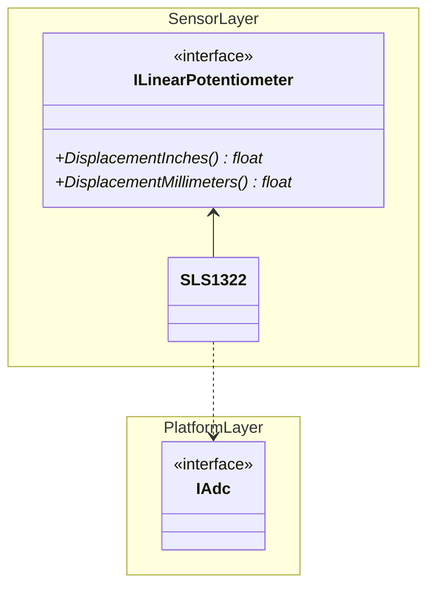

# Suspension Travel Potentiometers

This page was last updated: *{{ git_revision_date_localized }}*

## Description

* **Stakeholder**: Suspension lead
* **Use Case**: Reading the displacement to measure measure the suspension travel and shock absorption. A total of 4 potentiometers must be mounted on the vehicle.

## Supported Sensors

