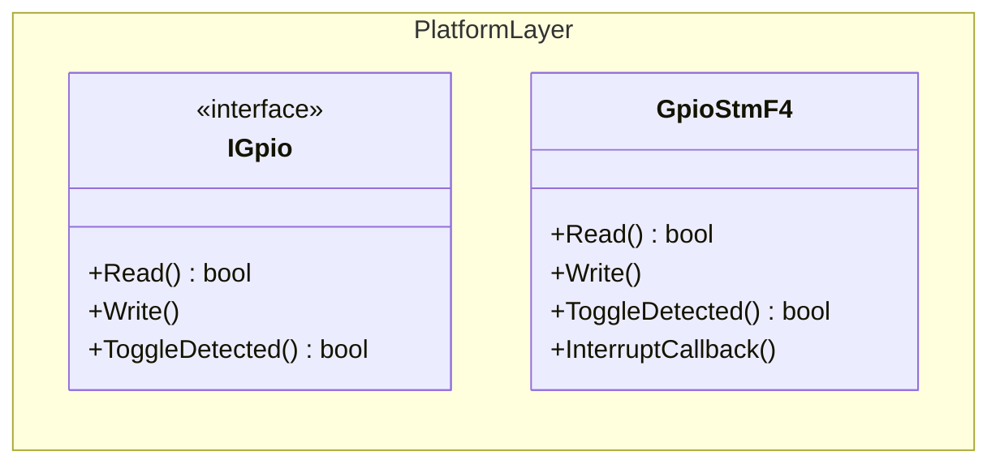
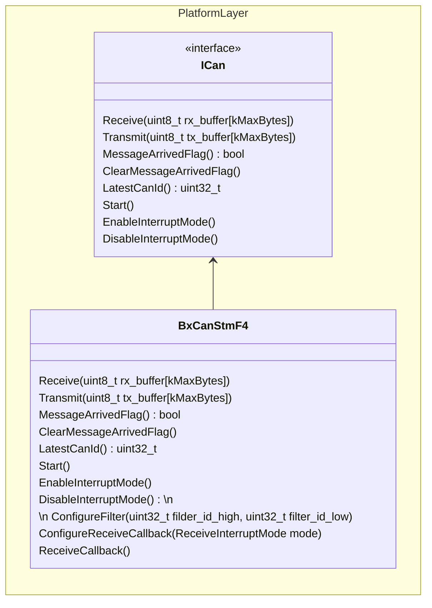
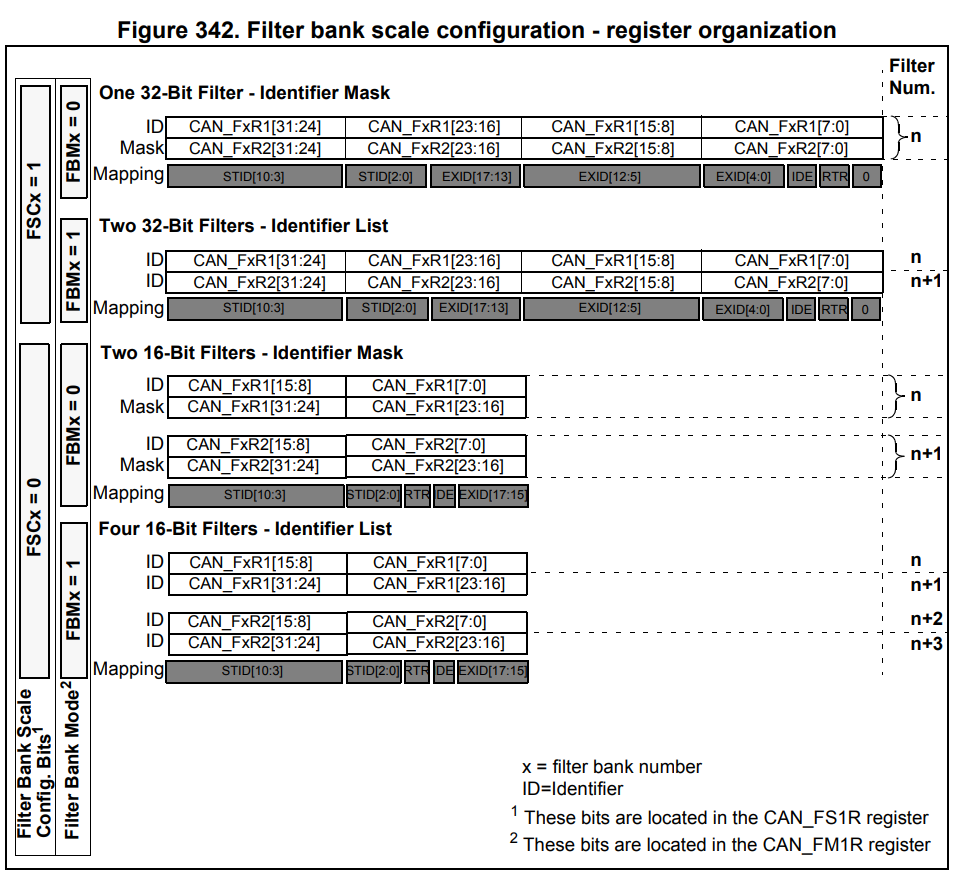

# STMicroelectronics

This page was last updated: *{{ git_revision_date_localized }}*

## F4 Product Line

### GPIO



#### Reading

!!! example
    Reading from a GPIO (port F, pin 15).

    ```C++
    void ReadFromGpio() {
        platform::GpioStmF4 gpio(GPIOF, GPIO_PIN_15);
        bool signal = gpio.Read();

        if (signal) {
            printf("Signal is HIGH\n");
        }
        else {
            printf("Signal is LOW\n");
        }
    }
    ```

#### Writing

!!! example
    Outputting a signal.

    ```C++
    void WriteToGpio() {
        platform::GpioStmF4 gpio(GPIOF, GPIO_PIN_15);

        printf("Outputing signal\n");
        gpio.Write(true);

        printf("Turning off signal\n");
        gpio.Write(false);
    }
    ```

!!! warning
    The `.Write()` method has not been tested on physical hardware.

#### Interrupt Callback

!!! example
    Implementing a callback function. Assume that the GPIO peripheral and pin has been configured on CubeMX for triggering an interrupt.

    Note that the `.ToggleDetected()` method automatically clears the internal flag.

    ```C++
    std::shared_ptr<platform::GpioStmF4> gpio_callback_ptr(nullptr);

    void HAL_GPIO_EXTI_Callback(uint16_t GPIO_Pin) {
        gpio_callback_ptr->InterruptCallback(GPIO_Pin);
    }

    int main() {
        auto toggle_switch = std::make_shared<platform::GpioStmF4>(GPIOF, GPIO_PIN_15);
	    gpio_callback_ptr = toggle_switch;

        for(;;) {
            if (toggle_switch.ToggleDetected()) {
                printf("GPIO state changed\n");
            }
        }
    }
    ```

### Basic Extended CAN



- The `BxCanStmF4` is a wrapper class that offers simple configurations of the device's BxCAN (Basic Extended) peripheral.
- This peripheral is only a CAN controller. So, an external CAN transceiver is required.
- An implementaion of the `ICan` abstract interface.

!!! warning
    As of now, this implementation only offers support for reading Extended CAN. Transmission and Classic CAN are not yet supported.

- It is up to the developer how to make use of this library while following the steps recommended by ST's CAN Firmware Driver API Description[^1].

[^1]: [STM32F4 HAL and Low-Layer Drivers](https://www.st.com/resource/en/user_manual/um1725-description-of-stm32f4-hal-and-lowlayer-drivers-stmicroelectronics.pdf), Section 9.2: CAN Firmware Driver API Description, pg 91.

!!! tip
    STM32CubeMx's code generation for the handle to the CAN peripheral already provides hardware initialization. Configurations and pin assignment is done using the `.ioc` file.

    In other words, this class offers configuration to the CAN peripheral **after** the configurations from CubeMX have been called.

Steps:

- With initializattion and pin assignment already handled, pass the handle to the peripheral (`hcanx`) to `BxCanStmF4`'s constructor.
- Configure the device's filter banks as a means of subscribing to certain CAN IDs.
- Start the CAN module to start receiving/sending messages.
- If using interrupt mode, configure the callback function and activate the notifications.


#### Filter Banks

Can be enabled using `ConfigureFilter()`. Every indificual call to this method will initialize a Filter Bank in hardware and is used to define a range of CAN IDs to listen. Using this given range, the invdividual filter bank will accept CAN messages and place them into the FIFO queue.

Up to 27 filters can be configured and they are separately owned by 2 FIFO queues. These queues and filter bakns can be configured separately, but the current implementation only assigns a CAN ID to each filter. 

Filter bank scale organization, bit-shifting per the registers for an extended ID
The implementation of automatically shifts the lower-bound value of the CAN ID range to the left by 3. This is necessary to provide the Extended CAN ID due to the `IDE`, `RTR`, and `0` register fields, as shown below in the *Mapping* row [^2].

[^2]: [STM32F4 Reference Manual](https://www.st.com/resource/en/reference_manual/dm00031020-stm32f405-415-stm32f407-417-stm32f427-437-and-stm32f429-439-advanced-arm-based-32-bit-mcus-stmicroelectronics.pdf), Section 32.7.4: Identifier Filtering, pg 1091. 



!!! example
    Configuring a single filter bank by defining a the higher and lower bounds of acceptable CAN IDs.

    ```c++
    void ConfigureFilterBank(uint8_t can_id) {
        // Assume that CubeMX code for `hcan1` has already occured
        platform::BxCanStmF4 bx_can_peripheral(hcan1);
        static constexpr uint16_t kHigherBoundMask = 0x1FFF;
        bx_can_peripheral.ConfigureFilter((can_id >> 13),
                                        (can_id & kHigherBoundMask));
    }
    ```

!!! warning
    As a library, this class needs more improvement in favor of additional configurability and robustness.

    Currently, the `BxCanStmF4` automatically assumes that each call to `ConfigureFilter()` is to be associated with a separate filter bank number. An internal count is maintained and incremented for this association. However, the following variables of the `CAN_FilterTypeDef filter_` object are all hard-coded:
    
    - `FilterMarkID` high and low
    - `FilterFIFOAssignment`
    - `FilterMode`
    - `FilterScale`
    - `SlaveStartFilterBank`

    Each of these are to be assigned values from macros defined in `stm32f4xx_hal_can.h`. One way possible approach is to use C++ enums as demonstrated in the next section for configuring Interrupt Modes.


#### Interrupt Mode

The ST HAL library expects the callback function of an interrupt signal to be overwritten and provided in the global scope. So, multiple things need access to the `BxCanStmF4` object:

- The interrupt callback function in the global scope.
- Sensor/Application components in their separate, local scope.
- The `ICan` abstract interface.

To support shareability, `std::shared_ptr` are highly encouraged over `std::unique_ptr`.

The `ConfigureReceiveCallback(ReceiveInterruptMode mode)` supports the following interrupt modes:

- New message is pending in FIFO queue 0.
- FIFO queue 0 is full.
- FIFO queue 0 is overrun.
- New message is pending in FIFO queue 1.
- FIFO queue 1 is full.
- FIFO queue 1 is overrun.

These options are based on the macros offered in `stm32f4xx_hal_can.h`:

```C
/* Receive Interrupts */
#define CAN_IT_RX_FIFO0_MSG_PENDING ((uint32_t)CAN_IER_FMPIE0)  /*!< FIFO 0 message pending interrupt */
#define CAN_IT_RX_FIFO0_FULL        ((uint32_t)CAN_IER_FFIE0)   /*!< FIFO 0 full interrupt            */
#define CAN_IT_RX_FIFO0_OVERRUN     ((uint32_t)CAN_IER_FOVIE0)  /*!< FIFO 0 overrun interrupt         */
#define CAN_IT_RX_FIFO1_MSG_PENDING ((uint32_t)CAN_IER_FMPIE1)  /*!< FIFO 1 message pending interrupt */
#define CAN_IT_RX_FIFO1_FULL        ((uint32_t)CAN_IER_FFIE1)   /*!< FIFO 1 full interrupt            */
#define CAN_IT_RX_FIFO1_OVERRUN     ((uint32_t)CAN_IER_FOVIE1)  /*!< FIFO 1 overrun interrupt         */
```

!!! example
    Sharing access to the `BxCanStmF4` object and configuring the interrupt signal to fire when a new CAN message is pending in FIFO queue 0.

```C++
// Standard Libraries
#include <memory>

// DFR Custom Dependencies
#include "Platform/CAN/STM/F4/bxcan_stmf4.hpp"
#include "Platform/CAN/Interfaces/ican.hpp"

// CAN Bus Interrupt Callback
std::shared_ptr<platform::BxCanStmF4> bx_can_callback_ptr(nullptr);

void HAL_CAN_RxFifo0MsgPendingCallback(CAN_HandleTypeDef *hcan) {
	bx_can_callback_ptr->ReceiveCallback();
}

using ReceiveInterruptMode = platform::BxCanStmF4::ReceiveInterruptMode;

void EnableCanBusInterrupts() {
    // Initialize BxCanStmF4 and ICan pointers
    auto bx_can_peripheral = std::make_shared<platform::BxCanStmF4>(hcan1);
	std::shared_ptr<platform::ICan> can_bus = bx_can_peripheral;

    // Pass the BxCanStmF4 object to Pe3
    auto pe3_ecu = std::make_unique<sensor::Pe3>(can_bus);
	const std::vector<uint32_t>& can_id_list = pe3_ecu->CanIdList();

    // Pass the BxCanStmF4 object to the global interrupt pointer
    bx_can_callback_ptr = bx_can_peripheral;

    bx_can_peripheral->Start();

    // Configure the Interrupt Mode
	ReceiveInterruptMode rx_interrupt_mode = ReceiveInterruptMode::kFifo0MessagePending;
	bx_can_peripheral->ConfigureReceiveCallback(rx_interrupt_mode);
	bx_can_peripheral->EnableInterruptMode();
}
```

Here, we are overwritting the `HAL_CAN_RxFifo0MsgPendingCallback()` function. There are other choices defined in `stm32f4xx_hal_can.h`:

```C
// Callback functions
void HAL_CAN_TxMailbox0CompleteCallback(CAN_HandleTypeDef *hcan);
void HAL_CAN_TxMailbox1CompleteCallback(CAN_HandleTypeDef *hcan);
void HAL_CAN_TxMailbox2CompleteCallback(CAN_HandleTypeDef *hcan);
void HAL_CAN_TxMailbox0AbortCallback(CAN_HandleTypeDef *hcan);
void HAL_CAN_TxMailbox1AbortCallback(CAN_HandleTypeDef *hcan);
void HAL_CAN_TxMailbox2AbortCallback(CAN_HandleTypeDef *hcan);
void HAL_CAN_RxFifo0MsgPendingCallback(CAN_HandleTypeDef *hcan);
void HAL_CAN_RxFifo0FullCallback(CAN_HandleTypeDef *hcan);
void HAL_CAN_RxFifo1MsgPendingCallback(CAN_HandleTypeDef *hcan);
void HAL_CAN_RxFifo1FullCallback(CAN_HandleTypeDef *hcan);
void HAL_CAN_SleepCallback(CAN_HandleTypeDef *hcan);
void HAL_CAN_WakeUpFromRxMsgCallback(CAN_HandleTypeDef *hcan);
void HAL_CAN_ErrorCallback(CAN_HandleTypeDef *hcan);
```

!!! tip
    Overwriting these functions are possible because, if you look at their implementation in `stm32f4xx_hal_can.c`, they are prepended with `__weak` in the function signature.

The `ReceiveCallback()` function is responsible for:

- Retrieving the data from the newly received CAN message and storing the byte array into `rx_buffer`.
- Setting a flag to indicate that a new message has arrived for processing.
- Grabbing the CAN ID.

If any modications are to be made to this function, be awre that `HAL_CAN_GetRxMessage()` must be the first instruction to occur. Otherwise, the callback function may not retrieve data from the new CAN message swiftly enough due to the time constraints of the interrupt signals.

This library gives the consumer full control over enabling/disabling interrupt signals at any time with `EnableInterruptMode()` and `DisableInterruptMode`.
