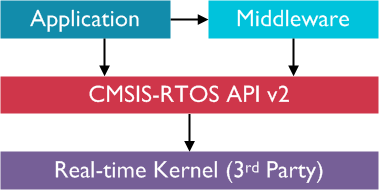

# Data Acquisition (DAQ) System

[Project Repository :simple-git:](https://github.com/DallasFormulaRacing/DataAcquisition2.0){ .md-button }

[Library API Docs :material-library:](#){ .md-button }

## Objective
- A Data Acquisition (DAQ) System for interfacing with the vehicle ECU and additional sensors.
- Build the first fully-fledged DAQ with re-usable code through:
    - The Layered Architecture design pattern
    - Modularity of components
    - Hardware abstraction
- Efficiently record data to a CSV file for system testing & refinement of other vehicle components via analyses.
- Make sensor data conveniently accessible for the whole DFR organization.
- To be used in tandem with DFR's [DataAnalyzer](https://github.com/DallasFormulaRacing/DataAnalyzer).

## Hardware and Equipment

{ width="200"; align=right }      

### Target Device
The [STM32 Nucleo F429ZI](https://www.st.com/en/evaluation-tools/nucleo-f429zi.html) microcontroller development board is used as the current target device for code merged to the `main` and `develop` branches. Theoretically, other Arm Cortex M4 based STM32 devices with the necessary peripherals should be able to run the same program.

                               
 
 
 

## Firmware Tech Stack :octicons-cpu-16:

### Board Support Package (BSP)

{ width="300"; align=right }

- STM32 Hardware Abstraction Layer ([HAL](https://www.st.com/resource/en/user_manual/um1725-description-of-stm32f4-hal-and-lowlayer-drivers-stmicroelectronics.pdf))
    - Generated by STM32CubeMX within the CubeIDE environment, which also provides the `arm-none-eabi` toolchain.
    - Serves as a set of low-level drivers to interface with the microcontroller.

### Real-Time

{ width="300"; align=right }

- [FreeRTOS](https://www.freertos.org/index.html)
    - A framework that offers multi-threading and concurrent programming.
    - For optimizing timing and performance.

{ width="300"; align=right }

- [CMSIS-RTOS v2](https://www.keil.com/pack/doc/CMSIS/RTOS2/html/group__CMSIS__RTOS.html)
    - Not to be mistaken for another RTOS framework.
    - An abstraction layer for interacting with an RTOS framework (i.e., FreeRTOS).

### File System

{ width="300"; align=right}

- [FatFS](http://elm-chan.org/fsw/ff/)
    - A library for creating files accessible through the FAT file system.
    - Allows end users to access the resulting CSV file on any device.

 
 
 

## DevOps and Automation :octicons-gear-16:

### Unit Tests

{ width="300"; align=right}

- [Google Test](https://google.github.io/googletest/)
    - A framework for writing unit tests.
    - Developed and ran on the developer's host device.
    - Compiled and ran using [CMake](https://cmake.org/cmake/help/latest/index.html) with [Ninja](https://ninja-build.org/manual.html).

### API Docs

* Our API documentation is built using a combination of three tools:
    - [Doxygen](https://www.doxygen.nl/) — A traditional tool generating documentation pages by scanning the C/C++ source code.
    - [Sphinx](https://www.sphinx-doc.org/en/master/) — A modernized, more aesthetic documentation tool.
    - [Breathe](https://breathe.readthedocs.io/en/latest/#) — A project that bridges and connects Doxygen and Sphinx

### Environments

{ width="300"; align=right }

- [Docker](https://docs.docker.com/get-started/overview/)
    - For building containerized environments with dependencies pre-installed.
    - Utilized for locally writing unit tests and API documentation.

### CI/CD Pipeline

Coming soon...

