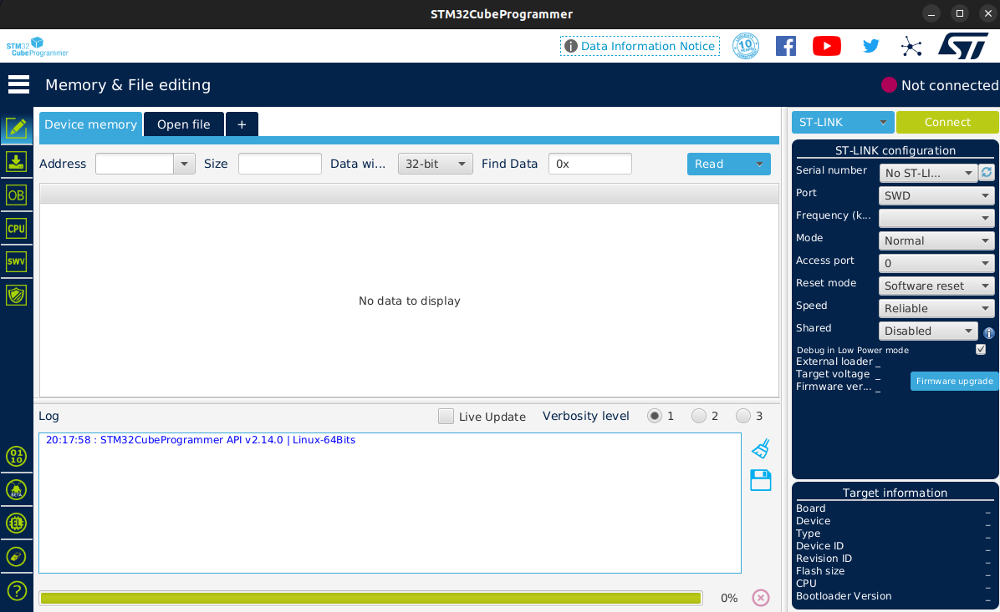
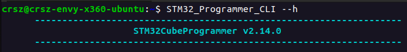

# OS Flashing Tools

## CubeProgrammer

This tool will be used for partitioning an SD card to support a Linux distribution. 

- Download the installer on [stm32CubeProgrammer](https://www.st.com/en/development-tools/stm32cubeprog.html).
  - This also includes the stm32CubeCLT (Command Line Tool) internally.
- Run the installer (the file ending with `.linux`) and accept all default options.
- To use the executable icon to launch the program, right-click it and select `Allow Launching`.
- Running the executable should successfully yield the following window:



## CubeCLT

This tool will allow CubeProgrammer to automate tasks for you, such as partioning the SD card for the file system.

Add the CLT to your environment paths. Open the file that runs everytime a Linux terminal is booted.

```
nano .bashrc
```

At the bottom of the file, add the following line to add the binaries to your paths. Then, save and close the file.

!!! tip

    When using `nano` to edit the file, press `ctrl+o` followed by `enter` to write to the file, then `ctrl+x` to exit.

```
export PATH=$HOME/STMicroelectronics/STM32Cube/STM32CubeProgrammer/bin:$PATH
```

Test that the following command works in a new terminal session:

```
STM32_Programmer_CLI --h
```

If successful, you should expect the following output:
 


