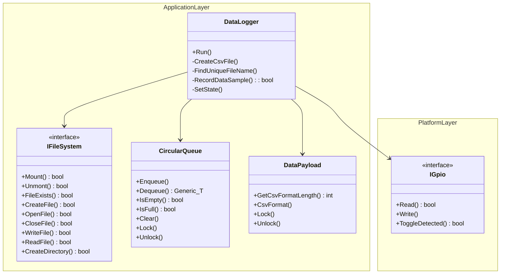
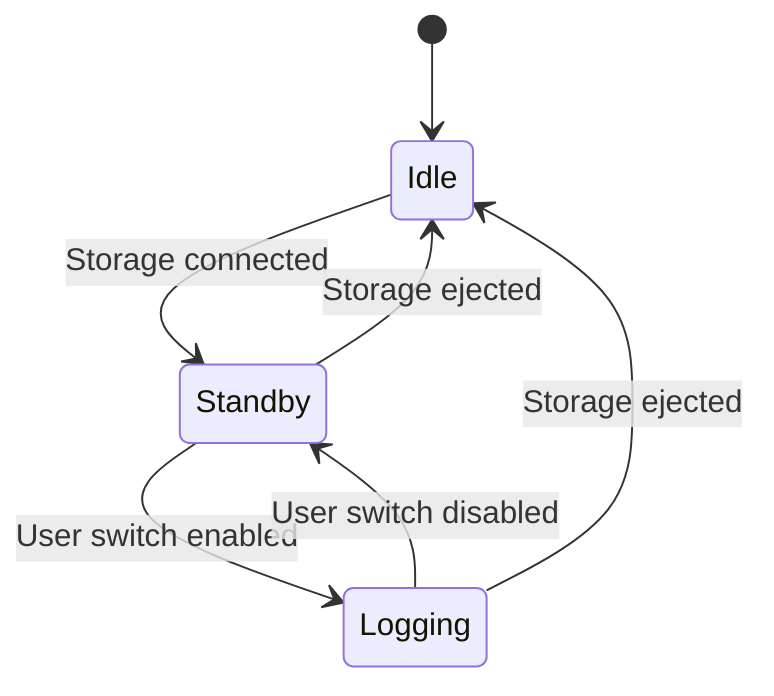
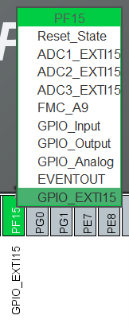
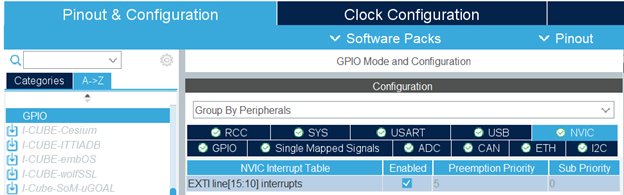
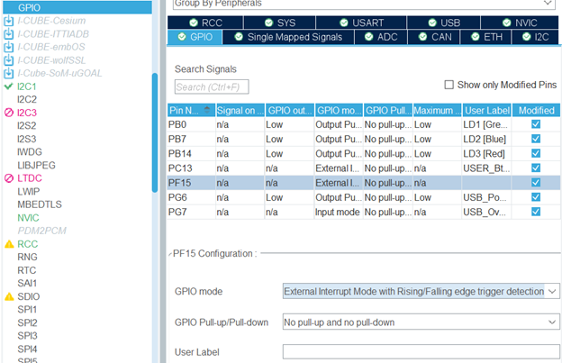

# Data Logger

This page was last updated: *{{ git_revision_date_localized }}*

## Details

- Integrates the following support logging to a CSV file:
    - Writing and storing files
    - User input toggling
    - Receiving data from a queue
- Observes whether the storage unit is connected or ejected.
- Shares a status indicator of whether it is currently logging. 


## Firmware Component Library

[Library API Docs :material-library:](#){ .md-button }

[Source Code :material-file-code:](https://github.com/DallasFormulaRacing/DAQ-Firmware-Libraries/blob/2c4a025f68137ac56061339a43fcc1cc42d8c74e/Application/DataLogger/DataLogger.hpp){ .md-button }



### How to Use

Be sure to provide all the dependencies:

- Any implementation of the [IFileSystem](../File%20System/index.md) interface, for managing files and block device mounting.
- Any implementation of the [IGpio]() interface, for reading a user's input to toggle data logging.
- The [CircularQueue]() and [DataPayload]() for receiving data as an input.
- A boolean that allows for observing whether the storage unit is connected or ejected.
- A boolean for sharing whether we are currently logging.

!!! example
    Using the `DataLogger`.

    ```C++
    int cppMain() {
        // Initialize DataLogger object
        DataLogger data_logger(...);

        for(;;) {
            data_logger.Run();
        }
    }
    ```

That is it! This library is kept simple to use due to the internal state machine. To get a full explanation on how to **integrate** the dependencies, go to the [Current Implementation](#current-implementation) section.

### State Machine

Internally, the `DataLogger` has the following states defined:

- `Idle`
- `Standby`
- `Logging`

This approach was taken to handle multiple cases due to the state of the storage unit being connected/ejected and providing the user control over when to log data.

This was implemented by using abstraction and inheritance. Each state inherits from `State()`, which defines that each state must have actions when entering, computing/executing, and exiting.

The `DataLogger` then has a private `SetState()` method for defining what happens at transitions:

- Perform exit actions.
- Change states.
- Perform entry actions.

Defining exit and entry actions ensures that something is performed only once, which can be beneficial for simplifying logic. No need to dedicate a boolean variable to indicate whether a particular action has been performed!

!!! info
    You can find a simple, minimalist example of implementing a state machine in this article: [Implementing a Finite State Machine in C++](https://www.aleksandrhovhannisyan.com/blog/implementing-a-finite-state-machine-in-cpp/) by Aleksandr Hovhannisyan.

    Note that in this article, instances of each state is created using a static method. In favor of a more idiomatic approach, we simply declared an instance of each state as a private variable.




#### Idle State

The default state at bootup. That is, entry actions does not occur when the device is booted.

- **Entry**: Unmount the file system.
- When the storage unit is connected, transition to the `Standby` state.
- **Exit**: Mount the file system.

#### Standby State

- When the storage unit is ejected, transition to the `Idle` state.
- When the user toggles the loging switch, and the switch's state is `HIGH`, then logging is enabled and transition to the `Logging` state.


#### Logging State

- **Entry**:
    - Create and open a new CSV file with a unique name
    - Clear the queue.
- When the storage unit is ejected, transition to the `Idle` state.
- When the user toggles the loging switch, and the switch's state is `LOW`, then logging is disabled and transition to the `Standby` state.
- If the queue is not empty, grab an instance of the data payload and record it to the CSV file.
- **Exit**: Close the CSV file.

## Current Implementation

### File System

Our [FatFs wrapper](../File%20System/fat_fs.md) fulfills the requirements of the `IFileSystem` interface. USB is used for our storage unit, so be sure to enable the following CubeMX settings described in that page's *USB in a Baremetal Environment* and *USB in an RTOS Environment* sections.

Thanks to our state machine, we only need one boolean variable to observe whether a USB flash drive is connected or ejected. Note that in C, there is no `bool` type, so we settle for using `uint8_t`.

In `USB_HOST/App/usb_host.c`:

```C
/* USER CODE BEGIN Includes */
uint8_t usb_connected_observer = 0;

static void USBH_UserProcess  (USBH_HandleTypeDef *phost, uint8_t id)
{
  /* USER CODE BEGIN CALL_BACK_1 */
  switch(id)
  {
  case HOST_USER_SELECT_CONFIGURATION:
  break;

  case HOST_USER_DISCONNECTION:
  Appli_state = APPLICATION_DISCONNECT;
  usb_connected_observer = 0; // Set to false
  break;

  case HOST_USER_CLASS_ACTIVE:
  Appli_state = APPLICATION_READY;
  usb_connected_observer = 1; // Set to true
  break;

  case HOST_USER_CONNECTION:
  Appli_state = APPLICATION_START;
  break;

  default:
  break;
  }
  /* USER CODE END CALL_BACK_1 */
}
```

Then, expose this global variable in other files as necessary:

```C++
#include "usb_host.h"
extern uint8_t usb_connected_observer;
```

This variable will be used for initializing the `DataLogger`.

### User Interrupt Signal

To provide the user the ability to toggle data logging, we leverage an interrupt signal. This is more power efficient and responsive than polling. A switch is preferrable over a push-button for two reasons:

- Enabling/disabling is visually noticeable to the user.
- No need to handle button de-bouncing in neither the hardware or firmware.

To enable a GPIO pin as an interrupt, enable the pin for **GPIO_EXTIx** on CubeMX. Do not enable it as a **GPIO_Input** — that is for polling operations. Then, enable the interrupt signal in the NVIC interrupt table.





Then, configure when the interrupt signal will occur. Note that these interrupt signals can be very sensitive. So, the `DataLogger` uses a strategy of being notified when the switch is toggled. When toggled, the `DataLogger` will poll the GPIO pin to confirm whether the state is `HIGH` or `LOW`. This helps toggling to be far less sporadic and unstable.



### Integrating

The `CircularQueue` and `DataPayload` are simple to provide to the `DataLogger`. Lastly, we just need to define a boolean variable for the `DataLogger` to internally update, according to whether it is logging.

!!! example
    Integrating `DataLogger` with `FatFs` to write to a USB.

    ```C++
    // 3rd Party Libraryes and Frameworks
    #include "fatfs.h"
    extern char USBHPath[4];   // USBH logical drive path
    extern FATFS USBHFatFS;    // File system object for USBH logical drive
    extern FIL USBHFile;       // File object for USBH

    #include "usb_host.h"
    extern uint8_t usb_connected_observer; // USB connected/ejected interrupt

    // DFR Custom Dependencies
    #include "../DFR_Libraries/Application/circular_queue.hpp"
    #include "../DFR_Libraries/Application/data_payload.hpp"
    #include "../DFR_Libraries/Application/DataLogger/DataLogger.hpp"
    #include "../DFR_Libraries/Application/FileSystem/fat_fs.hpp"
    #include "../DFR_Libraries/Platform/Interfaces/igpio.hpp"
    #include "../DFR_Libraries/Platform/STM/F4/GPIO/gpio_stmf4.hpp"

    std::shared_ptr<platform::GpioStmF4> gpio_callback_ptr(nullptr);

    void HAL_GPIO_EXTI_Callback(uint16_t GPIO_Pin) {
        gpio_callback_ptr->InterruptCallback(GPIO_Pin);
    }


    void DataLoggingThread() {
        MX_USB_HOST_Init();

        auto file_system = std::make_shared<application::FatFs>(USBHPath, USBHFatFS, USBHFile);

        auto toggle_switch = std::make_shared<platform::GpioStmF4>(GPIOF, GPIO_PIN_15);
        gpio_callback_ptr = toggle_switch;

        application::CircularQueue<application::DataPayload> queue(size);

        application::DataPayload data_payload;

        bool is_logging_flag = false;

        application::DataLogger data_logger(file_system,
                                            toggle_switch,
                                            queue,
                                            usb_connected_observer,
                                            is_logging_flag);

        for (;;) {
            data_logger.Run();
            osDelay(1000);

            if (is_logging_flag) {
                printf("Logging...\n");
            }
            else {
                printf("Either in Standby or Idle state...\n");
            }
        }
    }
    ```

