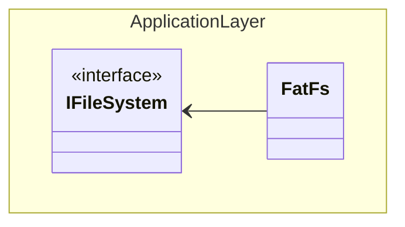

# Accelerometer

## Description

- Mounting and unmounting of the physical storage media.
- Opening/closing files with different permission modes.
- Writing to a file.
- Seeking for a file in a directory.

## Supported Implementations



## Additional Features

### POSIX-Compliant Flags

In the spirit of making this interface agnostic, POSIX-compliant flags are defined for supporting a consistent manner of opening files. For instance, to open a file in read-only mode, one may use something like `file_system.FileOpen("r");

```C++
// POSIX compliant mode flags
static constexpr char* kReadOnlyMode               = (char*)"r";
static constexpr char* kReadWriteMode              = (char*)"r+";
static constexpr char* kEmtpyFileAndWriteMode      = (char*)"w";
static constexpr char* kEmptyFileAndReadWriteMode  = (char*)"w+";
static constexpr char* kAppendFileAndWriteMode     = (char*)"a";
static constexpr char* kAppendFileAndReadWriteMode = (char*)"a+";
static constexpr char* kNewFileAndWriteMode        = (char*)"wx";
static constexpr char* kNewFileAndReadWriteMode    = (char*)"w+x";
```

### Error Setting

The following bitfields are defined and can be used by an implementation to support easier debugging of file system operations.

```C++
enum class ErrorFlags : uint16_t {
    Mounting        = 1 << 0,
    Unmounting      = 1 << 1,
    FileNotFound    = 1 << 2,
    CreateFile      = 1 << 3,
    OpenFile        = 1 << 4,
    ReadFile        = 1 << 5,
    WriteFile       = 1 << 6,
    CloseFile       = 1 << 7,
    CreateDirectory = 1 << 8
};

static constexpr uint8_t kNumErrorFlags = 9;
unsigned int errors_ : kNumErrorFlags;

void SetError(ErrorFlags flag) {
    errors_ |= static_cast<uint16_t>(flag);
}

unsigned int GetError(ErrorFlags flag) {
    return errors_ & static_cast<uint16_t>(flag);
}
```

