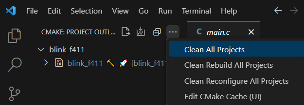
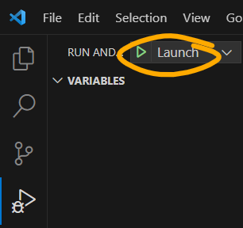
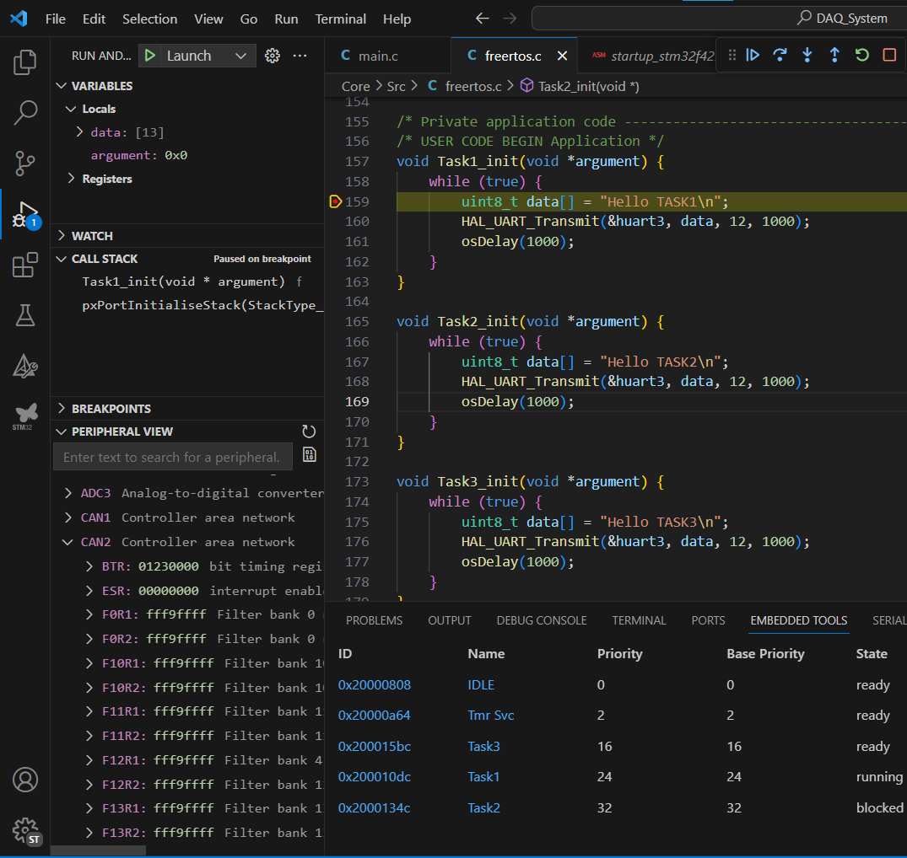

# Build, Flash, and Debug

This page was last updated: *{{ git_revision_date_localized }}*

## Before You Start
- To be safe that the `.ioc` file is not an issue, make sure you can build the program on CubeIDE.
- Install the following dependencies:
    - CubeCLT (requires [Make](https://gnuwin32.sourceforge.net/packages/make.htm) & CubeIDE) — Flashing/erasing the program on the dev board's flash memory.
    - [CMake](https://cmake.org/download/) — Compiling the code.
    - VSCode extensions
        - Embedded Tools by Microsoft — Viewing processor registers, RTOS data viewer, etc.
        - C/C++ by Microsoft — Syntax highlighting.
        - CMake Tools by Microsoft — a build generator. Note that the STM32 extension also installs Ninja. That is, CMake is leveraging Ninja to perform the compilation and linking, instead of Make.
        - GNU Linker Map Files
        - Arm Assembly

## Opening the Project
- Open VSCode after cloning this repo.
- Under the stm32 extension, import the project's `.cproject` file.
- The package manager, `vcpackage` will immediately start to configure CMake and Ninja for compiling the program.
- Select a build preset for CMake to use. `Release` is the most optimized for performance and reduced size of the resulting binaries. However, we cannot debug. So, for development, use the `Debug` preset. 

## Cleaning Previous Builds
- Deleting old build files (binaries, executables, debugging meta-data, etc.) may be necessary only occasionally.
- Do this first step if you want to ensure a "clean build."
- Under the CMake extension, click the ellipsis button to **clean** the project. This is removing any lingering binaries and executables from previous builds.



## Compiling/Building

- Under the CMake extension, click on the **build** button.


- You should be able to see the output of building/compiling in the `./build/debug/build` directory.
- You will find the following important files: `.bin`, .`hex`, and `.elf` (Executable Linker File). Any one of these files can be used to flash the dev board.

!!! tip
    Alternatively, use the following command at the project's root directory:
    
    ```
    cmake --build ./build/debug/build --target DAQ_System
    ```

!!! tip
    Alternatively, use a VSCode task.
    
    - Assuming a Windows platform, press `ctrl+p`.
    - Type `task`.
    - Select `Build`.

    This task is defined in the `.vs/tasks.json` file, and uses commands made available through stm32CubeCLT (Command Line Tool).

## Flashing the Board

To run the code on the development microcontroller board, we must load the build output (binaries, executables, etc.) into the device's Flash memory. Flashing through CubeIDE is the preferred method.

!!! tip
    Alternatively, use the following command at the project's root directory:
    
    ```
    STM32_Programmer_CLI -c port=SWD -w ./build/debug/build/blinkf411.elf 0x08000000
    ```

    This command is enabling SWD for programming, and writing to the starting address of the "code region" in flash memory (namely, `0x08000000`).

!!! tip
    Alternatively, use a VSCode task.
    
    - Assuming a Windows platform, press `ctrl+p`.
    - Type `task`.
    - Select `Flash`.

    This task is defined in the `.vs/tasks.json` file, and uses commands made available through stm32CubeCLT (Command Line Tool).

## Debugging

- Set a breakpoint
- Launch the debugger



!!! note
    Initializing the debugger also flashes the board, but instead uses the *Debug profile* instead of the *Release profile*. These two flash settings differ in performance, and sometimes the Relase profile may have different behavior. It's important to test the firmware on the hardware within both profiles.

- You can hit "Resume" to allow the board to run.



This gets you access to:

- Local variables
- Registers
- Values updated via Watch expressions.
- Peripheral view — see the contents of registers and peripherals.

# Flashing a Custom Board

Using SWD is the easiest approach, as it minimizes hardware requirements. Only a minimum of 4 pins need to be accessible, which are to be attached to a debugger/programmer device (such as the ST-Link V2/V3):

- `GND`
- `SWCLK`
- `SWDIO`
- `VDD`

Flashing may work without the `VDD` pin being used. However, this may work inconsistently and may fail the flash operation. This is used to read the voltage levels of the target device.

Notice that the `NRST` pin is not being used. This pin is only necessary if the firmware were to re-purpose and configure these pins into something other than SWD.
