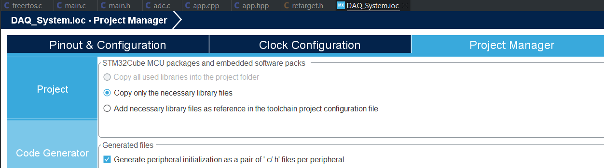

# Code Generator Configs

This page was last updated: *{{ git_revision_date_localized }}*

### Code Generator
- To split the auto-generated code on a per-peripheral basis, open the `.ioc` file > Project Manager > Code Generator > Enable `Generate peripheral initialization as a pair of '.c/.h' files per peripheral`

