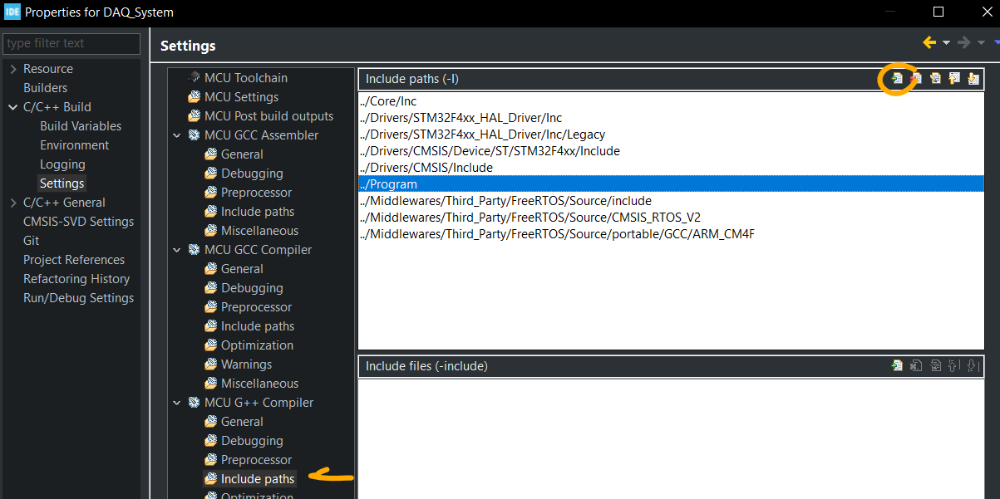
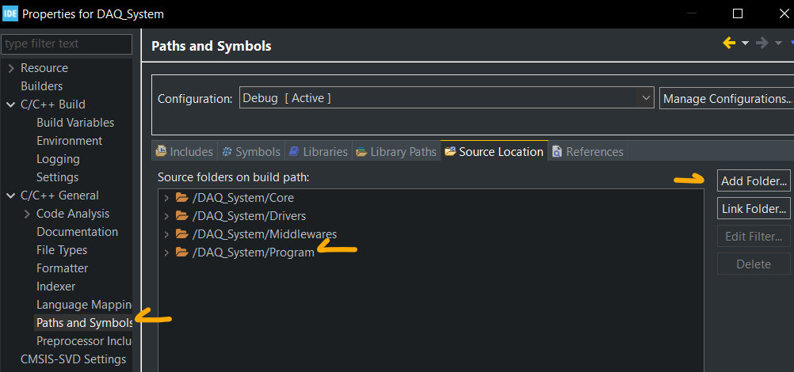
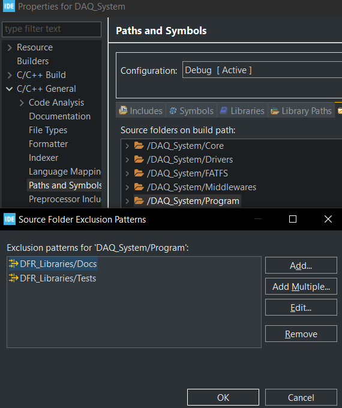

# Enabling C++

This page was last updated: *{{ git_revision_date_localized }}*

## Separating C & C++
- Reference article: [Where to add new h and cpp file in stm32cubeide project](https://stackoverflow.com/questions/68306194/where-to-add-new-h-and-cpp-file-in-stm32cubeide-project)
- Creating a separate `Program/` folder with `app.hpp` and `app.cpp` that contains a new super loop function to escape from the auto-generated `main.c` super loop.
- Right-click Project > Properties > C/C++ Build > Tool Setting (tab) > MCU GCC Compiler or MCU G++ Compiler > Include paths
- For C++ files, change the Include Paths config for the G++ compiler instead of the GCC compiler



Then, you may get an "undefined reference" error for the calling code. In this case, `cppMain()` had an undefined reference, despite the `#include ""` lines and changing the Include Paths settings of the compiler.
- Reference article: [Undefined reference to function stm32cubeide](https://pcbartists.com/firmware/stm32-firmware/undefined-reference-to-function-stm32-cubeide-solution/)
- Right-click Project > Properties > C/C++ General > Paths and Symbols > "Source Location" tab > Add Folder



Finally, you may need to add `extern` guards. In this case because C++ code was calling for `retarget.h`, a C file, the following changes was made:
```C
// All credit to Carmine Noviello for this code
// https://github.com/cnoviello/mastering-stm32/blob/master/nucleo-f030R8/system/include/retarget/retarget.h

#ifndef _RETARGET_H__
#define _RETARGET_H__

#ifdef __cplusplus
extern "C" {
#endif

// The rest of the code
...

#ifdef __cplusplus
}
#endif

#endif //#ifndef _RETARGET_H__
```

## Excluding from Build

Sometimes it may be useful to exclude specific files or sub-directories from being compiled. This can be done by double-clicking the parent-folder of interest in the "Source Location" tab of the "Paths and Symbols" window. Then, add any directories you do **not** want to be compiled when building the CubeIDE project.

For example, after moving our firmware libraries to a separate repository as a git submodule, we do not want the `Tests/` and `Docs/` directory to be compiled and flashed to the microcontroller as they are intended to run in different environments. So, for firmware development, exclude them from build as shown below.


