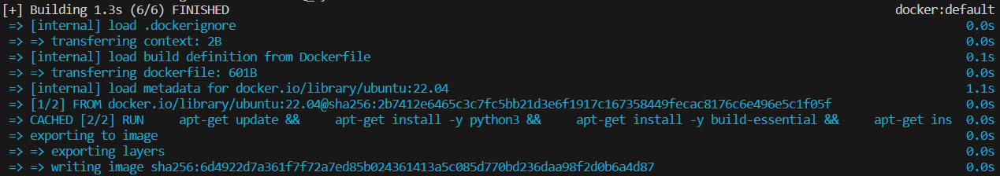
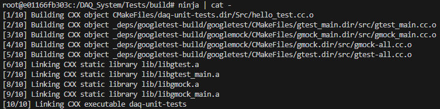
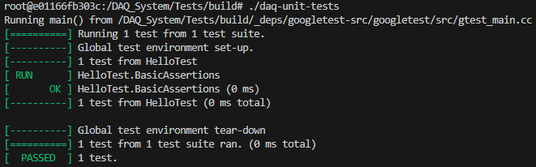
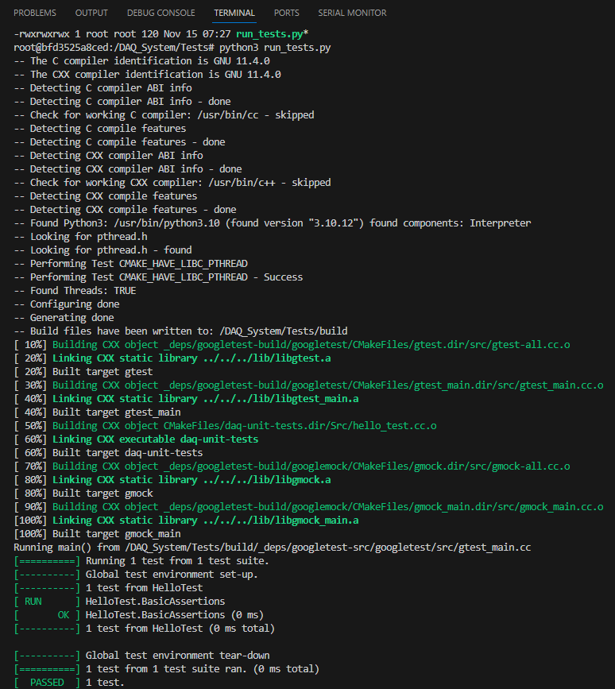

# Unit Testing

This page was last updated: *{{ git_revision_date_localized }}*

## Building the Linux Environment using Docker

First, install [Docker Desktop](https://www.docker.com/products/docker-desktop/). Creating an account is not necessary for our use case.

Move into the [DAQ-Firmware-Libraries sub-module repo](https://github.com/DallasFormulaRacing/DAQ-Firmware-Libraries).

```
cd ./Project/DAQ_System/Program/DFR_Libraries
```

Build the docker image using the Dockerfile:
```
docker build -t ubuntu-tests-image ./Tests
```



Using the image, create a container, start the container, and mount the volume to the project:

- This command must be used at the shared parent directory of both `Tests/` and the firmware.
- Execute this specific command in command prompt, _not_ git bash. Git bash somehow alters the path and causes an error.

```
docker run -itd --name daq-test-container -v .:/Project ubuntu-tests-image
```

Attach the image's terminal input/output to yours:
```
docker attach daq-test-container
```

The first two commands only have to be done once. Your host PC will store the docker image and docker container.
To use the docker Linux environment in a later session, simply use the `attach` command and repeat the steps below.

## Compiling and Running Unit Tests
Once you are running in the container, move into the unit testing directory:
```
cd Tests
```

Use CMake to generate a build system:

- Specify Ninja as the build system with the `-G` flag. Omitting this flag will default to using Make for the compilation process, which is slower than Ninja.
- Specify the path to the source code to be built with the `-S` flag.
- Specify the path for storing the build output (cache, executable, etc.)
    - Creates the `DAQ_System/Tests/build` folder if it does not exist.
    - This is where configurations for the Ninja build system are stored.
    - This command needs to be used only when you need to create this folder.

```
cmake -G "Ninja" -S . -B ./build
```

For compiling, move into the new folder (your build system environment). From here on out, we only need to use Ninja commands.
```
cd build
```


Compile the GoogleTest framework and our unit tests:

- Ninja detects when the shell terminal is used and automatically overwrites the same terminal line. To see a multi-line output of the order in which the files are being built, concatenate and print the output using `cat`. That is, use the `ninja | cat -` command instead.
- If seeing every detail of the output is necessary, use `ninja -v` to enable verbose (ugly, but informative) output.
- Otherwise, the below command will show the build output in only one line.

```
ninja
```




Run the resulting executable:
```
./daq-unit-tests
```



## Cleaning Build Files
Sometimes, a "clean build is necessary." That is, to clean (remove all "dirty" or old build files) and re-build from scratch. You only need two commands:
```
ninja clean
ninja
```

If there is any doubt of whether absolutely everything is removed (such as cached files), you can manually delete the `./build` folder and re-run the `cmake` command to recreate it with new build system configurations.

When you are done, type `exit` to leave the container.

## Good to Know
It is worth noting that building with `make` instead of `ninja` more explicitly shows how a file is compiled to a target link library. That is, the output shows the `hello_tests.cc` was built and linked into the `daq-unit-tests` target link library (executable). This more accurately reflects the `CMakeLists.txt` file and may be helpful to keep in mind when adding more files to be linked.



## Official Docs
- [Docker](https://docs.docker.com/get-started/overview/)
- [Google Test](https://google.github.io/googletest/)
- [CMake](https://cmake.org/cmake/help/latest/index.html)
- [Ninja](https://ninja-build.org/manual.html)
