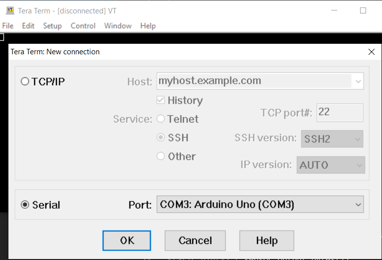
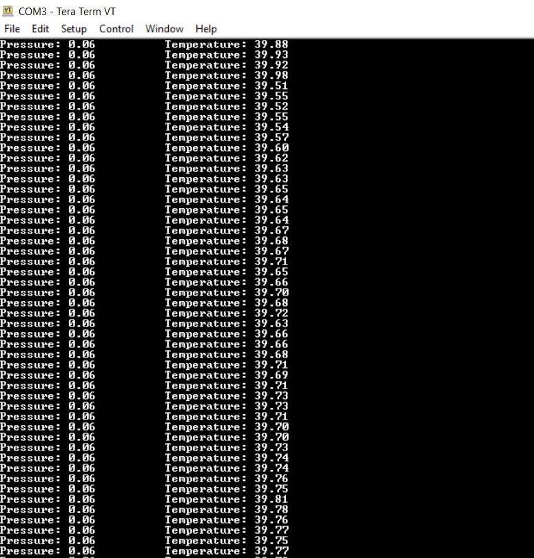

# Viewing Serial Output

This page was last updated: *{{ git_revision_date_localized }}*

## Serial Viewer on VSCode.
- Download the Serial Viewer extension.
- Open the **Serial Monitor** tab in the terminal.
- Configure the settings as necessary.

**For example**: Suppose a USART peripheral is outputting serial data through a virtual COM port using the following configurations:

<figure markdown>
  
  <figcaption>USART initialization code auto-generated by CubeMX</figcaption>
</figure>

!!! note

    For the 8-bit word length configured on USART, we set 7 data bits on the Serial Viewer. This is because the 8th bit is the stop bit.

So, we match these settings on the Serial Viewer:

!!! tip 

    This VSCode extension allows you to log serial output as a text file and is incredibly useful for viewing serial output with a high payload and frequency.

## Tera Term

This is recommended for end users, not maintainers and developers. Tera Term allows for configuring the receiving serial port of a user's computer to match the transmitter's settings and can be [downloaded here](https://sourceforge.net/projects/tera-term/).

!!! example
    
    Connect the Arduino Uno R3 to your computer via USB. Open Tera Term. Select **Serial** and the corresponding device port. Select **Ok**.

<figure markdown>
  { width="600" }
  <figcaption>Initial connection settings</figcaption>
</figure>

<figure markdown>
  { width ="300" }
  <figcaption>Output</figcaption>
</figure>

