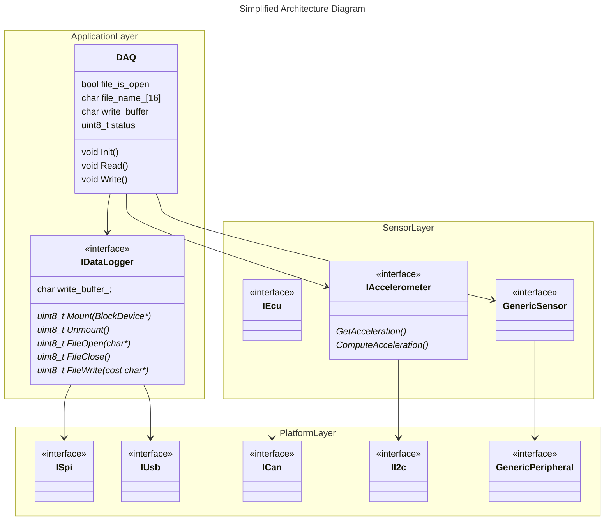

# Architecture Overview

This codebase utilizes the Layered Architecture. In practice, this is reflected in the firmware by separating each layer with folder directories and C++ namespaces while encouraging loosed coupling between components.

## Application Layer
  - High-level code.
  - Will mostly consist of logic rather than nitty-gritty details.
  - Will not be constrained to a particular product.

## Sensor Layer
  - Low-level code.
  - Consists of drivers. That is, libraries to support sensors and external devices.
  - Product-specific code.

## Platform Layer
  - Low-level code.
  - Access to microcontroller peripherals.
  - Platform-specific code. Such as, making use of I2C on an STM32 with the HAL library vs. on a TI microcontroller.

## Diagrams

!!! note

    This diagram is simplified by removing the concrete/implementation classes. In reality, the concrete classes (i.e., the implementation of the abstract interfaces) utilize the abstract interfaces of the Platform layer. For instance, a specific implementation of the Accelerometer (not `IAccelerometer`) may utilize the `II2C` interface.

    The complete, more accurate illustration of the architecture is shown below.

Coming soon...
