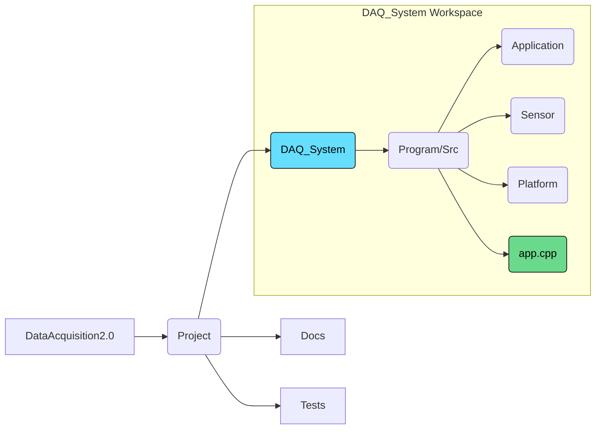
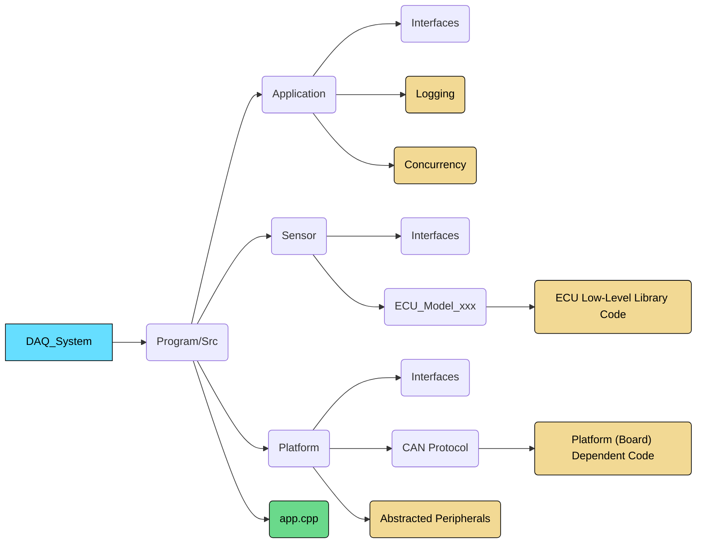

# File Structure

## Overall Repo
* The `DAQ_System` folder will be the workspace intended to be the final deliverable. This is the actual codebase we are working towards.

#### Legend
* Blue — Root of the workspace
* Green — Main file of the workspace

## DAQ_System Workspace

#### Legend
* Blue — Root of the workspace
* Green — Main file of the workspace
* Yellow — Key differences among the layers of code