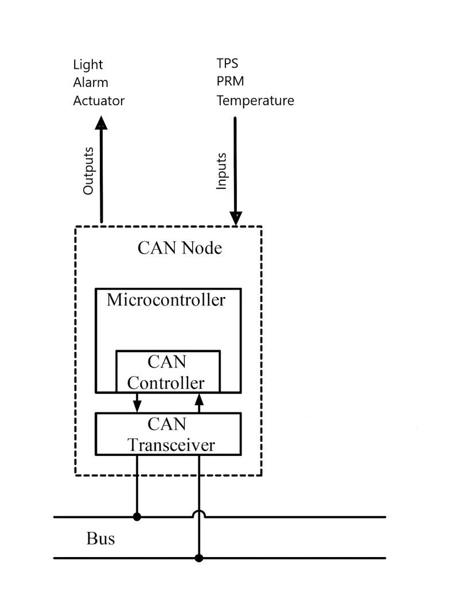
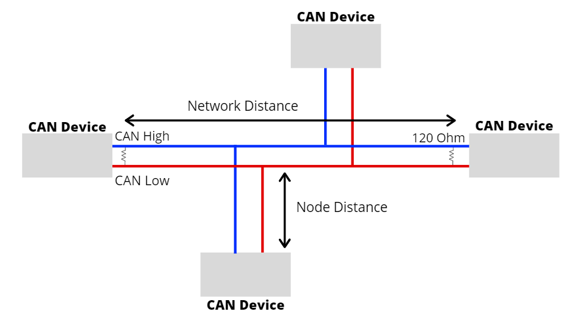
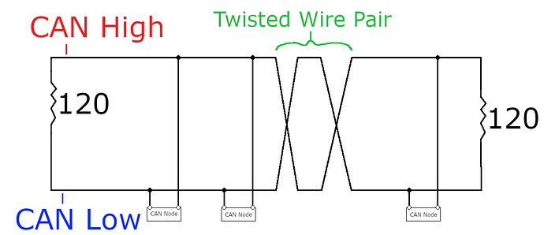
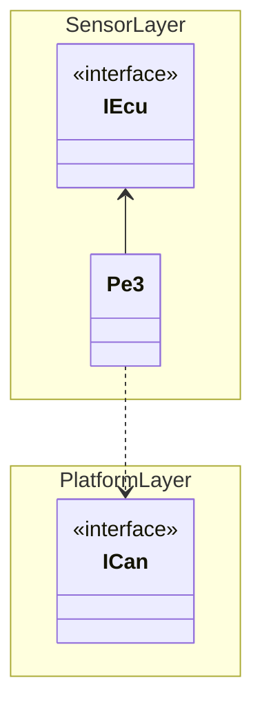

# Engine Control Unit (ECU)

This page was last updated: *{{ git_revision_date_localized }}*

!!! info
    The ECU is under the `Sensor` layer as it behaves as an array of sensors with the "black box" mindset.

## Description

A CAN *node* is a device that is participating in the CAN bus network.[^1]

[^1]: [What is a CAN Bus System?](https://www.flexihub.com/can-bus/) by Olga Weis.

<figure markdown>
  { width="500" }
  <figcaption>A generic CAN node</figcaption>
</figure>

To build a CAN bus, you need at least two nodes and exactly two 120 Ohm termination resistors. These resistors serve to prevent the signal from reflecting.[^2]

[^2]: [Introduction to CAN Bus](https://www.seeedstudio.com/blog/2019/11/27/introduction-to-can-bus-and-how-to-use-it-with-arduino/) by Yida.

<figure markdown>
  
  <figcaption>Standardized termination resistors</figcaption>
</figure>

It is **highly** recommended to twist the CAN Hi and Lo wires for improving signal integrity.[^3]

[^3]: [Overview of the CAN Bus Protocol](https://forum.digikey.com/t/overview-of-the-can-bus-protocol/21170) on DigiKey TechForum.

<figure markdown>
  
  <figcaption>Twisted Pair Wiring</figcaption>
</figure>

## Nomenclature

Keep in mind that *CAN 2.0A* is equivalent to *Classic CAN* while *CAN 2.0B* is equivalent to *Extended CAN*.

Extended CAN is backwards-compatible with Classic CAN, but not vice-versa.

CAN FD is a standard exceeding that of Extended CAN.

## Supported Sensors

