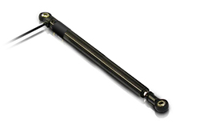
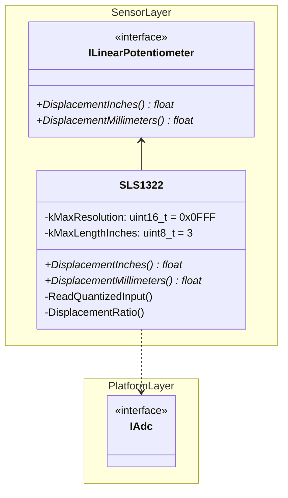

# SLS 1322-3

This page was last updated: *{{ git_revision_date_localized }}*

## Details

[Sensor Datasheet :octicons-book-16:](https://www.activesensors.com/datasheet/general-purpose-linear-potentiometers/WS-SLS1300.pdf){ .md-button }

{ align=right }

- **Sensor**: [SLS 1322-3](https://www.activesensors.com/products/linear-position-sensors/general-purpose-linear-potentiometers) Linear Potentiometer by Active Sensors.
- **Frequency**: 3 to 4 Hz.
- **Communication**: Analog.
- **Max Rod Length**: 3 inches.
- **Linear Function of Kilo-Ohm to Distance**: $25 \  k\Omega + 100$.
    - Increases by 1 Kilo-Ohm every 25 millimeters.
    - $125 \ mm \approx 1 \ k\Omega$
    - $450 \ mm \approx 14 \ k\Omega$ 

## Pinout

|    Sensor   |      MCU      |
|:-----------:| :-----------: |
|     VCC     |      3.3V     |
|     GND     |      GND      |
|    Signal   | Analog Input  |

## Mounting


## Firmware

[Library API Docs :material-library:](#){ .md-button }

[Source Code :material-file-code:](https://github.com/DallasFormulaRacing/DataAcquisition2.0/tree/develop/Project/DAQ_System/Program/Src/Sensor/LinearPotentiometer){ .md-button }

### Implementation Details

This library allows for polling the ADC[^1]. This consists of performing the following steps:

[^1]: [STM32F4 HAL User Manual](https://www.st.com/resource/en/user_manual/um1725-description-of-stm32f4-hal-and-lowlayer-drivers-stmicroelectronics.pdf), page 60, section *Polling mode IO operation*.

- Starting the ADC peripheral.
- Polling for an analog-to-digital conversion. A timeout waiting value can be specified.
- Retrieving the output from the ADC. 

The accuracy of the output is dependent on the resolution of the ADC and is represented as an integer after quantization. In other words, the **Quantized Count**[^2] of the analog signal is in the range of $[0, 2^{resolution} - 1]$.

[^2]: More information on [analog signal quantization](https://www.tutorialspoint.com/digital_communication/digital_communication_quantization.htm).

!!! example

    The STM32 Nucleo-F429ZI microcontroller has ADCs with a resolution of 12-bits. So, the range of the integer value of the measured analog signal is $[0, 4095]$.

The ADC's resolution is a known constant defined by the hardware. This is used to compute ratios between the measured Quantized Count and the resolution. The value of the ratio varies between $[0.0, 1.0]$ depending on the retraction/displacement of the linear potentiometer.

$$
Retraction \ Ratio = Quantized \ Count / Resolution
$$

$$
Displacement \ Ratio = 1 - Retraction \ Ratio
$$

Finally, the displacement ratio is multiplied with the linear potentiometer's maximum length in inches or millimeters. The length of the sensor's rod at full extension is about $3$ inches.

### CubeMX Settings

Per analog pin:

- Enable the anlog channel, such as `IN0` (channel 0)
- Continuous conversion: `Enabled`

### How to Use



!!! example
    How to initialize the `SLS1322` object and read the analog signal by interacting with the `ILinearPotentiometer` interface.

```C++
// Standard Libraries
#include <memory>

// ST HAL Dependencies
#include "adc.h"
extern ADC_HandleTypeDef hadc1;

// DFR Custom Dependencies
#include "app.hpp"
#include "Sensor/LinearPotentiometer/ilinear_potentiometer.hpp"
#include "Sensor/LinearPotentiometer/sls1322.hpp"

void cppMain() {
    std::unique_ptr<sensor::ILinearPotentiometer> lin_pot(nullptr);
    lin_pot = std::make_unique<sensor::SLS1322>(hadc1);

    float displacement_inches = 0.0f;
    displacement_inches = lin_pot->DisplacementInches();
}
```
